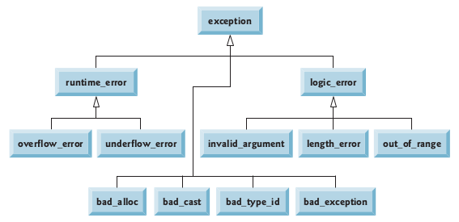

# Exception Handling


[Introduction](#Introduction)

1. [Exceptions in C++ library](#Exceptions-in-C-library)
2. [Extending C++ Exception Hierarchy](#Extending-C-Exception-Hierarchy)


## Introduction

An exception is an indication of a problem that occurs during a program’s execution. The name “exception” implies that the problem occurs infrequently—if the “rule” is that a statement normally executes correctly, then the “exception to the rule” is that a problem occurs. Exception handling enables you to create applications that can resolve (or handle) exceptions. In many cases, handling an exception allows a program to continue executing as if no problem had been encountered. A more severe problem could prevent a program from continuing normal execution, instead requiring the program to notify the user of the problem before terminating in a controlled manner. The features presented in this chapter enable you to write robust and fault-tolerant programs that can deal with problems that may arise and continue executing or terminate gracefully.

Program logic frequently tests conditions that determine how program execution proceeds. Consider the following pseudocode:

```
Perform a task
If the preceding task did not execute correctly
	Perform error processing
Perform next task
If the preceding task did not execute correctly
	Perform error processing
…
```

> Exception handling enables you to remove error-handling code from the “main line” of the program’s execution, which improves program clarity and enhances modifiability.

### Exceptions in C++ library

The header `<exception>` provides several classes and functions related to exception handling in C++ programs. Most important of which is [`exception`](https://en.cppreference.com/w/cpp/error/exception), base class for exceptions thrown by the standard library components.

Several convenience classes are predefined in the header `<stdexcept>` to report particular error conditions. These classes can be divided into two categories: *logic* errors and *runtime* errors. Logic errors are a consequence of faulty logic within the program and may be preventable. Runtime errors are due to events beyond the scope of the program and can not be easily predicted.

| Defined in header `<stdexcept>`                              |                                                              |
| ------------------------------------------------------------ | ------------------------------------------------------------ |
| [logic_error](https://en.cppreference.com/w/cpp/error/logic_error) | exception class to indicate violations of logical preconditions or class invariants (class) |
| [invalid_argument](https://en.cppreference.com/w/cpp/error/invalid_argument) | exception class to report invalid arguments (class)          |
| [domain_error](https://en.cppreference.com/w/cpp/error/domain_error) | exception class to report domain errors (class)              |
| [length_error](https://en.cppreference.com/w/cpp/error/length_error) | exception class to report attempts to exceed maximum allowed size (class) |
| [out_of_range](https://en.cppreference.com/w/cpp/error/out_of_range) | exception class to report arguments outside of expected range (class) |
| [runtime_error](https://en.cppreference.com/w/cpp/error/runtime_error) | exception class to indicate conditions only detectable at run time (class) |
| [range_error](https://en.cppreference.com/w/cpp/error/range_error) | exception class to report range errors in internal computations (class) |
| [overflow_error](https://en.cppreference.com/w/cpp/error/overflow_error) | exception class to report arithmetic overflows (class)       |
| [underflow_error](https://en.cppreference.com/w/cpp/error/underflow_error) | exception class to report arithmetic underflows (class)      |





C++ provides `try` blocks to enable exception handling. A `try` block consists of keyword `try` followed by braces ( `{}` ) that define a block of code in which exceptions might occur. The `try` block encloses statements that might cause exceptions and statements that should be skipped if an exception occurs.

Exceptions are processed by **catch handlers** (also called **exception handlers**), which catch and handle exceptions. At least one catch handler must immediately follow each try block. Each catch handler begins with the keyword `catch` and specifies in parentheses an **exception parameter** that represents the type of exception the catch handler can process ( e.g. logic_error). Exceptions are always caught by reference.

### Extending C++ Exception Hierarchy

For example, we can implement a divide-by-zero exception like:

```c++
// Class DivideByZeroException definition.
#include <stdexcept> // contains runtime_error
using namespace std;

/**
	* DivideByZeroException
	* exception object should be thrown by functions
	* upon detecting division-by-zero exceptions
	*/
class DivideByZeroException : public runtime_error 
{
public:
   // constructor specifies default error message
   DivideByZeroException()
      : runtime_error( "attempted to divide by zero" ) {}
}; // end class DivideByZeroException

```

This class can be used to throw an exception in a situation like:

```c++
// A simple exception-handling example that checks for
// divide-by-zero exceptions.
#include <iostream>
#include "DivideByZeroException.h" // exception class 
using namespace std;

// perform division and throw DivideByZeroException
// object if divide-by-zero exception occurs
double quotient( int numerator, int denominator )
{
   // throw DivideByZeroException if trying to
   // divide by zero
   if ( denominator == 0 )
     	// terminate function
      throw DivideByZeroException(); 

   // return division result
   return
     static_cast< double >( numerator ) / denominator;
} // end function quotient

int main()
{
   int number1; // user-specified numerator
   int number2; // user-specified denominator
   double result; // result of division

   cout << "Enter two integers (end-of-file to end): ";

   // enable user to enter two integers to divide
   while ( cin >> number1 >> number2 ) 
   {
      // try block contains code that might
     	// throw exception and code that should
     	// not execute if an exception occurs
      try 
      {
         result = quotient( number1, number2 );
         cout << "The quotient is: " << result << endl;
      } // end try
      catch ( DivideByZeroException &
             		divideByZeroException ) 
      {
         cout << "Exception occurred: " 
            << divideByZeroException.what() << endl;
      } // end catch

      cout << "\nEnter two integers "
        	<< "(end-of-file to end): ";
   } // end while

   cout << endl;
} // end main

```

Output

```
Enter two integers (end-of-file to end): 100 7
The quotient is: 14.2857
Enter two integers (end-of-file to end): 100 0
Exception occurred: attempted to divide by zero
Enter two integers (end-of-file to end): ^C
```


[^ Top](#Exception-Handling)