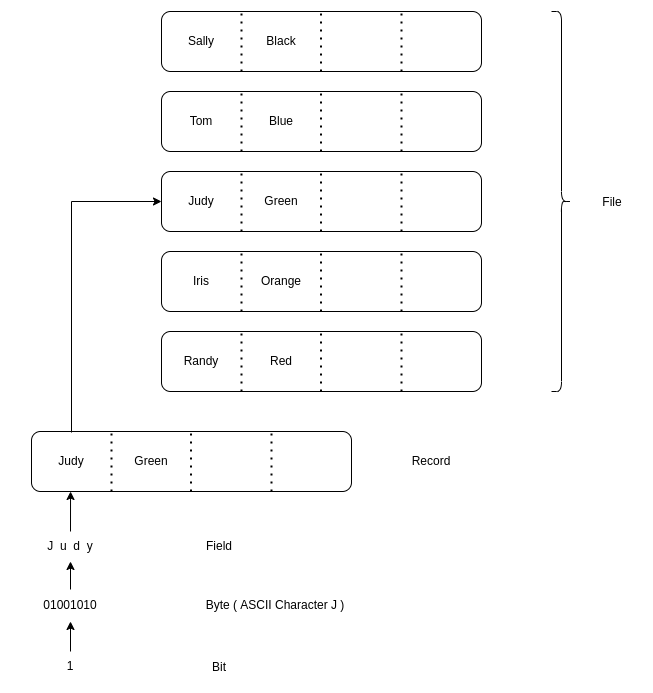
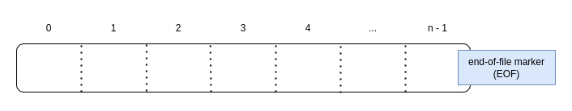
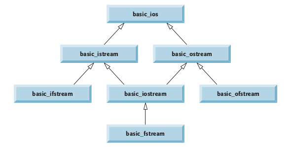
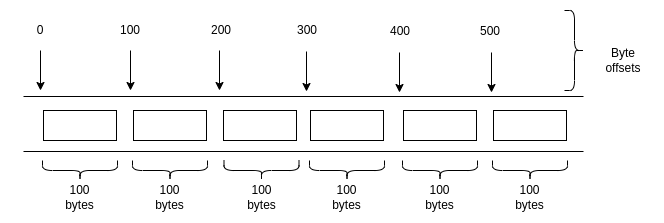

# File Processing


[Introduction](#Introduction)

1. [Data Hierarchy](#Data-Hierarchy)
2. [Files and Streams](#Files-and-Streams)
3. [Sequential Files](#Sequential-Files)
4. [Unformatted File I/O](#Unformatted-File-I/O)
    1. [read, write and gcount](#read,-write-and-gcount)

5. [Random Access Files](#Random-Access-Files)
    1. [Creating a Random-Access File](#Creating-a-Random-Access-File)
    2. [The reinterpret_cast Operator](#The-reinterpret_cast-Operator)
    3. [Example Program](#Example-Program)

6. [Companion Code](#Companion-Code)


## Introduction

Storage of data in memory is temporary. Files are used for data persistence—permanent retention of data. Computers store files on secondary storage devices, such as hard disks, CDs, DVDs, flash drives and tapes. C++ library provides class hierarchy for **formatted** and **unformatted** processing of files.

## Data Hierarchy

Ultimately, all data items that digital computers process are reduced to combinations of zeros and ones. The smallest unit of data that computers can process is called a bit (short for “binary digit”—a digit that can assume one of two values). Programming with data in the low-level form of bits is cumbersome. For humans, It’s preferable to program with data in forms such as **decimal digits** (0–9), **letters** (A–Z and a–z) and **special symbols** (e.g., $, @, %, &, * and many others) referred to as **characters**. The set of all characters used to write programs and represent data items on a particular computer is called that computer’s character set. Because computers can process only 1 s and 0 s, every character in a computer’s character set is represented as a pattern of 1 s and 0 s. **Bytes** are composed of eight bits. We create programs and data items with characters; computers manipulate and process these characters as patterns of bits. In turn, C++ provides data type like **char**.

Just as characters are composed of bits, **fields** are composed of characters. A field is a group of characters that conveys some meaning. For example, a field consisting of upper-case and lowercase letters can represent a person’s name.

Data items processed by computers form a **data hierarchy**, in which data items become larger, more complex and abstract in structure as we progress from bits, to characters, to fields and to larger data aggregates.





Typically, a record (which can be represented as a class in C++) is composed of several fields (called data members in C++). In a payroll system, for example, a record for a particular employee might include the following fields:

1. Employee identification number
2. Name
3. Address
4. Hourly pay rate
5. Year-to-date earnings
6. Amount of taxes withheld

A file is a group of related records. A company’s payroll file normally contains one record for each employee. Thus, a payroll file for a small company might contain only 22 records, whereas one for a large company might contain 10,000 records.

To facilitate retrieving specific records from a file at least one field, that can have a **unique value**, in each record is chosen as a **record key**. In the payroll record example, the **employee identification number** normally would be chosen as the record key. There are many ways of organizing records in a file. A common type of organization
is called a **sequential file**, in which records typically are stored in order by a record-key field. 

Most businesses use many different files to store data. For example, a company might
have payroll files, accounts-receivable files (listing money due from clients), accounts-pay-
able files (listing money due to suppliers), inventory files (listing facts about all the items
handled by the business) and many other types of files. A group of related files often are
stored in a **database**. A collection of programs designed to create and manage databases is
called a **database management system** (DBMS).

## Files and Streams





C++ views each file as a sequence of bytes (Fig. 17.2). Each file ends either with an **end-of-file marker** or at a specific byte number recorded in an operating-system-maintained, administrative data structure. When a file is opened, an object is created, and a stream is associated with the object. Same as objects `cin` , `cout` , `cerr` and `clog` are created when `<iostream>` is included. The streams associated with these objects provide communication channels between a program and a particular file or device (`stdin`, `stdout`, `stderr`).

To perform file processing in C++, header files `<iostream>` and `<fstream>` must be included. Header `<fstream>` includes the definitions for the stream class templates

- `basic_ifstream`
- `basic_ofstream`
- `basic_fstream`

The `<fstream>` header declares services for user-controlled file processing. 

Each class template has a predefined template specialization that enables char I/O. In addition, the `<fstream>` library provides typedef aliases for these template specializations. For example,

| Class Template   | `typedef` Specialization | Description                                        |
| ---------------- | ------------------------ | -------------------------------------------------- |
| `basic_ifstream` | `ifstream`               | specialized `char`  stream-input                   |
| `basic_ofstream` | `ofstream`               | specialized `char`  stream-output                  |
| `basic_fstream`  | `fstream`                | specialized `char`  stream-input and stream-output |

Files are opened by creating objects of these stream template specializations. Following figure summarizes the inheritance relationships of the I/O classes.




Instantiating an object of `ifstream`, `ofstream` or `fstream` with a **filename** and **file-open mode** as arguments to the constructor opens a file.

| Class      | Description                      |
| ---------- | -------------------------------- |
| `ifstream` | Read from file                   |
| `ofstream` | Write to the file                |
| `fstream`  | Read and/or write from/to a file |

For an `ofstream` object, the file-open mode can be either of the following except `ios::in`. Existing files opened with mode `ios::out` are **truncated**—all data in the file is discarded. If the specified file does not yet exist, then the `ofstream` object creates the file, using that filename. Multiple file-open modes can be used using a *bit-wise or* between every two (like `ios::out | ios::binary`). 

| Mode          | Description                                                  |
| ------------- | ------------------------------------------------------------ |
| `ios::app`    | Append all output to the end of the file.                    |
| `ios::ate`    | Open a file for output and move to the end of the file (normally used to append data to a file). Data can be written anywhere in the file. |
| `ios::in`     | Open a file for input.                                       |
| `ios::out`    | Open a file for output.                                      |
| `ios::trunc`  | Discard the file’s contents (this also is the default action for `ios::out` ). |
| `ios::binary` | Open a file for binary (i.e., non-text or binary data) input or output. |

An `ofstream` object can be created without opening a specific file—a file can be attached to the object later. For example, the statement

```c++
ofstream outFile;
```

creates an `ofstream` object named `outFile` . The `ofstream` member function `open` opens a file and attaches it to an existing ofstream object as follows:

```c++
outFile.open( "file.dat", ios::out );
```

Another useful overloaded `ios` member function— operator void * —converts the stream to a pointer, so it can be tested as 0 (i.e., the null pointer) or nonzero (i.e., any other pointer value). When a pointer value is used as a condition, C++ interprets a null pointer in a condition as the `bool` value false and interprets a non-null pointer as the `bool` value true.

```c++
ofstream outFile( "file.dat", ios::out );
if( !outFile )
{
  cerr << "File could not be opened!" << endl;
  exit( 1 );
}
```

Similarly for an `ifstream` object operator void * can be used to check the condition of the stream pointer:

```c++
while ( inFile >> id >> name >> score )
	outputLine( id, name, score );
```


## Sequential Files

C++ imposes no structure on a file. Thus, a concept like that of a “record” does not exist in a C++ file. Files can be classified by the way data is organized in them. A sequential file **contains records organized by the order in which they were entered**. It means data is stored in a **chronological order** based on account number or some other **identifying data**. In order to locate the desired data, sequential files must be read starting at the beginning of the file. A sequential file  may be stored on a sequential access device such as magnetic tape or on a direct access device such as magnetic disk.

To retrieve data sequentially from a file, programs normally start reading from the beginning of the file and read all the data consecutively until the desired data is found. It might be necessary to process the file sequentially several times (from the beginning of the file) during the execution of a program.

Both `istream` and `ostream` provide member functions for repositioning the **file-position pointer** (the byte number of the next byte in the file to be read or written). These member functions are `seekg` (“seek get”) for `istream` and `seekp` (“seek put”) for `ostream` . Each `istream` object has a “get pointer” which indicates the byte number in the file from which the next input is to occur, and each `ostream` object has a “put pointer” which indicates the byte number in the file at which the next output should be placed.

| Function | Class     | Description                                                |
| -------- | --------- | ---------------------------------------------------------- |
| `seekg`  | `istream` | move get pointer relative to a position                    |
| `tellg`  | `istream` | read the position of get pointer (in bytes from beginning) |
| `seekp`  | `ostream` | move put pointer relative to a position                    |
| `tellp`  | `ostream` | read the position of put pointer (in bytes from beginning) |

The statement

```c++
inFile.seekg( 0 );
```

repositions the file-position pointer to the beginning of the file (location 0 ) attached to `inFile`. The argument to `seekg` normally is a long integer.

A second argument can be specified to indicate the seek direction, which can be `ios::beg` (the default) for positioning relative to the beginning of a stream, `ios::cur` for positioning relative to the current position in a stream or `ios::end` for positioning relative to the end of a stream.

| Position   | Description                                  |
| ---------- | -------------------------------------------- |
| `ios::beg` | relative to the beginning of a stream        |
| `ios::cur` | relative to the current position of a stream |
| `ios::end` | relative to the end of a stream              |

The file-position pointer is an integer value that can also be referred to as the *offset* from the beginning of the file. Some examples of positioning the “get” file-position pointer are

```c++
// position to the nth byte of fileObject (assumes ios::beg)
fileObject.seekg( n );
// position n bytes forward in fileObject
fileObject.seekg( n, ios::cur );
// position n bytes back from end of fileObject
fileObject.seekg( n, ios::end );
// position at end of fileObject
fileObject.seekg( 0, ios::end );
```

The same operations can be performed using `ostream` member function `seekp` . Member functions `tellg` and `tellp` are provided to return the current locations of the “get” and “put” pointers, respectively. The following statement assigns the “get” file-position pointer value to variable location of type long:

```c++
location = fileObject.tellg();
```

Let's take a look at an example of sequential file processing programs. First, we have to create a new file:

```cpp
// Create a sequential file.
#include <iostream>
#include <string>
#include <fstream> // file stream
#include <cstdlib> // exit function prototype
using namespace std;

int main()
{
   // ofstream constructor opens file                
   ofstream outClientFile(
     						"clients.dat",			 // file name
     						ios::out | ios::app  // mode: open for writing, open in
     																 // append mode if file already exists.
   					);

   // exit program if unable to create file
   if ( !outClientFile ) // overloaded ! operator
   {
      cerr << "File could not be opened" << endl;
      exit( 1 );  // exit with error
   } // end if

   cout << "Enter the account, name, and balance." << endl
      << "Enter end-of-file to end input.\n? ";

   int account;
   string name;
   double balance;

   // read account, name and balance from cin, then place in file
   while ( cin >> account >> name >> balance )
   {
      outClientFile << account << ' ' << name << ' ' << balance << endl;
      cout << "? ";
   } // end while
} // end main
```

Now, for reading a sequentially organized file:

```cpp
// Reading and printing a sequential file.
#include <iostream>
#include <fstream> // file stream
#include <iomanip>
#include <string>
#include <cstdlib> // exit function prototype
using namespace std;

void outputLine( int, const string, double ); // prototype

int main()
{
   // ifstream constructor opens the file          
   ifstream inClientFile(
     						"clients.dat",
     						ios::in					// mode: open for reading
   					);

   // exit program if ifstream could not open file
   if ( !inClientFile ) 
   {
      cerr << "File could not be opened" << endl;
      exit( 1 );
   } // end if

   int account;
   string name;
   double balance;

   cout << left << setw( 10 ) << "Account" << setw( 13 ) 
      << "Name" << "Balance" << endl << fixed << showpoint;

   // display each record in file
   while ( inClientFile >> account >> name >> balance )
      outputLine( account, name, balance );
} // end main

// display single record from file
void outputLine( int account, const string name, double balance )
{
   cout << left << setw( 10 ) << account << setw( 13 ) << name
      << setw( 7 ) << setprecision( 2 ) << right << balance << endl;
} // end function outputLine
```

In order to find the required data in a sequential file, we have to traverse it from start to end (probably many times in a program's life time):

```cpp
// Credit inquiry program.
#include <iostream>
#include <fstream>
#include <iomanip>
#include <string>
#include <cstdlib> // exit function prototype
using namespace std;

enum RequestType { ZERO_BALANCE = 1, CREDIT_BALANCE, DEBIT_BALANCE, END };
int getRequest();
bool shouldDisplay( int, double );
void outputLine( int, const string, double );

int main()
{
   // ifstream constructor opens the file
   ifstream inClientFile( "clients.dat", ios::in );

   // exit program if ifstream could not open file
   if ( !inClientFile ) 
   {
      cerr << "File could not be opened" << endl;
      exit( 1 );
   } // end if

   int request;
   int account;
   string name;
   double balance;

   // get user's request (e.g., zero, credit or debit balance)
   request = getRequest();

   // process user's request
   while ( request != RequestType::END ) 
   {
      switch ( request ) 
      {
        case RequestType::ZERO_BALANCE:
            cout << "\nAccounts with zero balances:\n";
            break;
        case RequestType::CREDIT_BALANCE:
            cout << "\nAccounts with credit balances:\n";
            break;
        case RequestType::DEBIT_BALANCE:
            cout << "\nAccounts with debit balances:\n";
            break;
      } // end switch

      // read account, name and balance from file
      inClientFile >> account >> name >> balance;

      // display file contents (until eof)
      while ( !inClientFile.eof() ) 
      {
         // display record
         if ( shouldDisplay( request, balance ) )
            outputLine( account, name, balance );

         // read account, name and balance from file
         inClientFile >> account >> name >> balance;
      } // end inner while
      
      inClientFile.clear();    // reset eof for next input
      inClientFile.seekg( 0 ); // reposition to beginning of file
      request = getRequest();  // get additional request from user
   } // end outer while
   
   cout << "End of run." << endl;
} // end main

// obtain request from user
int getRequest()
{ 
   int request; // request from user

   // display request options
   cout << "\nEnter request" << endl
      << " 1 - List accounts with zero balances" << endl
      << " 2 - List accounts with credit balances" << endl
      << " 3 - List accounts with debit balances" << endl
      << " 4 - End of run" << fixed << showpoint;

   do // input user request
   {
      cout << "\n? ";
      cin >> request;
   } while ( request < ZERO_BALANCE && request > END );

   return request;
} // end function getRequest

// determine whether to display given record
bool shouldDisplay( int type, double balance )
{
   // determine whether to display zero balances
   if ( type == RequestType::ZERO_BALANCE && balance == 0 )
      return true;
   
   // determine whether to display credit balances
   if ( type == RequestType::CREDIT_BALANCE && balance < 0 )
      return true;

   // determine whether to display debit balances
   if ( type == RequestType::DEBIT_BALANCE && balance > 0 )
      return true;

   return false;
} // end function shouldDisplay

// display single record from file
void outputLine( int account, const string name, double balance )
{
   cout << left << setw( 10 ) << account << setw( 13 ) << name
      << setw( 7 ) << setprecision( 2 ) << right << balance << endl;
} // end function outputLine
```

### Updating Sequential Files

Data that is formatted and written to a sequential file **cannot be modified without the risk of destroying** other data in the file. For example, if the name “ White ” needs to be changed to “ Worthington ” the old name cannot be overwritten without corrupting the file. The record for White was written to the file as

```
300 White 0.00 
```

If this record were rewritten beginning at the same location in the file using the longer name, the record would be

```
300 Worthington 0.00
```

The new record contains six more characters than the original record. Therefore, the characters beyond the second “ o ” in “ Worthington ” would **overwrite the beginning of the next sequential record** in the file. The problem is that, in the formatted input/output model using the stream insertion operator `<<` and the stream extraction operator `>>` , fields—and hence records—can vary in size. For example, values 7, 14, –117, 2074, and 27383 are all `int`s, which store the same number of “raw data” bytes internally (typically four bytes on a 32-bit machine and eight bytes on a 64-bit machine). However, these integers become different-sized fields when output as formatted text (character sequences). Therefore, **the formatted input/output model usually is not used to update records in place**.

Such updating can be done awkwardly. For example, to make the preceding name change, the records before 300 White 0.00 in a sequential file could be copied to a new file, the updated record then written to the new file, and the records after 300 White 0.00 copied to the new file. This requires *processing every record in the file to update one record*. If many records are being updated in one pass of the file, though, this technique can be acceptable.

## Unformatted I/O

As explained in the stream I/O section, unformatted (binary) input/output is performed using the `read` and `write` member functions of `istream` and `ostream` , respectively. Member function read inputs (designated number of) bytes to a file; member function write outputs (designated number of) bytes from a character array.

### read, write and gcount

```cpp
// istream class
istream & read (char * buf, streamsize n);
      // Read n characters from istream and keep in char array buf.
      // Unlike get()/getline(), it does not append null char at the end of input.
      // It is used for binary input, instead of C-string.
streamsize gcount() const;
      // Return the number of character extracted by the last unformatted input operation
      // get(), getline(), ignore() or read().
 
// ostream class
ostream & write (const char * buf, streamsize n)
      // Write n character from char array.
```

Processing of random access files is performed using reading and writing binary data to files. We'll look at the concepts and library function in detail in the next section.

## Random-Access Files

Sequential files are inappropriate for **instant-access applications**, in which a particular record must be located immediately. Common instant-access applications are airline reservation systems, banking systems, point-of-sale systems, automated teller machines and other kinds of **transaction-processing systems** that require rapid access to specific data. A bank might have hundreds of thousands (or even millions) of other customers, yet, when a customer uses an automated teller machine, the program checks that customer’s account in a few seconds or less for sufficient funds. This kind of instant access is made possible with **random-access files**. Individual records of a random-access file can be accessed directly (and quickly) without having to search other records.

C++ does not impose structure on a file. So the application that wants to use random-access files must create them. A variety of techniques can be used. Perhaps the easiest method is to require that *all records in a file be of the same fixed length*. Using same-size, fixed-length records makes it easy for a program to calculate (as a function of the record size and the record key) the exact location of any record relative to the beginning of the file.

Figure illustrates C++’s view of a random-access file composed of fixed-length records (each record, in this case, is 100 bytes long). A random-access file is like a railroad train with many same-size cars—some empty and some with contents.



Data can be inserted into a random-access file without destroying other data in the file. Data stored previously also can be updated or deleted without rewriting the entire file.

### Creating a Random-Access File

The `ostream` member function `write` outputs a fixed number of bytes, beginning at a specific location in memory, to the specified stream. When the stream is associated with a file, function write writes the data at the location in the file specified by the “put” file-position pointer. The `istream` member function read inputs a fixed number of bytes from the specified stream to an area in memory beginning at a specified address. If the stream is associated with a file, function read inputs bytes at the location in the file specified by the “get” file-position pointer.

When writing the integer number to a file, instead of using the statement

```cpp
outFile << number;
```

which for a four-byte integer could print as few digits as one or as many as 11 (10 digits plus a sign, each requiring a single byte of storage), we can use the statement

```cpp
outFile.write(
  reinterpret_cast< const char * >( &number ),
	sizeof( number )
);
```

which always writes the binary version of the integer’s four bytes (on a machine with four-byte integers). Function `write` treats its first argument as a group of bytes by viewing the object in memory as a `const char *`, which is a pointer to a byte. Starting from that location, function write outputs the number of bytes specified by its second argument—an integer of type `size_t`.

Similarly, for reading we can use the statement

```cpp
inFile.read(
  reinterpret_cast< const char * >( &number ),
	sizeof( number )
);
```

which always reads the binary version of the integer’s four bytes (on a machine with four-byte integers).

### The reinterpret_cast Operator

Unfortunately, most pointers that we pass to function write as the first argument are not of type `const char *`. To output objects of other types, we must convert the pointers to those objects to type `const char *`; otherwise, the compiler will not compile calls to function write. C++ provides the `reinterpret_cast` operator for cases like this in which a pointer of one type must be cast to an unrelated pointer type.

A `reinterpret_cast` is performed at compile time and does not change the value of the object to which its operand points. Instead, it requests that the compiler reinterpret the operand as the target type (specified in the angle brackets following the keyword `reinterpret_cast` ).

### Example Program

Following example demonstrates how to write unformatted data to a file. Let's first lay down the utility header:

```cpp
// inputs.h
#ifndef INPUTS_H
#define INPUTS_H

#include <string>
using namespace std;

// clear ostream buffer
void ignoreLine();
// read a valid integer input
int getInteger( const string & );
// read a valid float input
float getFloat( const string & );
// read a valid string input
string getString( const string &, const int );
// ask an answer in Yes or No
char askYesNo( const string & );

#endif
```


```cpp
// inputs.cpp
#include <iostream>
#include <limits>
#include "inputs.h"

// clear output buffer
void ignoreLine()
{
    std::cin.ignore(
            std::numeric_limits<std::streamsize>::max(),
            '\n');
}

// ask user for an integer input
int getInteger( const string &prompt )
{
    while( true ) // Loop until user enters a valid input
    {
        std::cout << prompt;
        int x;
        std::cin >> x;

        // Check for failed extraction
        if( ! std::cin ) // has a previous extraction failed?
        {
            // yep, so let's handle the failure
            std::cin.clear(); // put us back in 'normal' operation mode
            ignoreLine(); // and remove the bad input
            std::cerr << "Oops, that input is invalid.  Please try again.\n";
        }
        else
        {
            ignoreLine(); // remove any extraneous input
            return x;
        }
    }
} // end function getInteger

// ask user for an float input
float getFloat( const string &prompt )
{
    while( true ) // Loop until user enters a valid input
    {
        std::cout << prompt;
        float x;
        std::cin >> x;

        // Check for failed extraction
        if( ! std::cin ) // has a previous extraction failed?
        {
            // yep, so let's handle the failure
            std::cin.clear(); // put us back in 'normal' operation mode
            ignoreLine(); // and remove the bad input
            std::cerr << "Oops, that input is invalid. Please try again.\n";
        }
        else
        {
            ignoreLine(); // remove any extraneous input
            return x;
        }
    }
} // end function getFloat

string getString( const string &prompt, const int length )
{
    while( true ) // Loop until user enters a valid input
    {
        std::cout << prompt;
        char str[length];
        std::cin.getline( str, length );

        // Check for failed extraction
        if( ! std::cin ) // has a previous extraction failed?
        {
            // yep, so let's handle the failure
            std::cin.clear(); // put us back in 'normal' operation mode
            ignoreLine(); // and remove the bad input
            std::cerr << "Oops, that input is invalid.  Please try again.\n";
        }
        else
        {
            return string(str);
        }
    }
} // end function getString

// get an answer in Yes or No from user
char askYesNo( const string &prompt )
{
    char request; // request from user

    // display request options
    cout << prompt << endl;
    do // input user request
    {
        cout << "(Y/N) ? ";
        request = getchar();
        ignoreLine();
    } while ( ( request != 'y' && request != 'Y' ) &&
            ( request != 'n' && request != 'N' ) );

    cout << endl;
    return request;
} // end function askYesNo
```


```cpp
// record.h
#ifndef RECORD_H
#define RECORD_H

#include <fstream>
#include <string>
using namespace std;

// const length for name char array
const int NAME_LENGTH = 30;

class Student
{
public:
    // default constructor
    Student( int = 0, string = "", float = 0.0 );
    // accessor functions for Student object
    Student &setID( int id );
    int getID() const { return id_; }
    Student &setName( string name );
    string getName() const { return string( name_ ); }
    Student &setScore( float score );
    float getScore() const { return score_; }
    // print record stored in "this" object
    void print();
    // check if "this" record is deleted
    bool isNullRecord();

private:
    // alias definition for a student record
    int id_;
    char name_[NAME_LENGTH];
    float score_;
};

// get number of student records in the file
int getRecordCount( fstream & );
// ask for a record number to search
int getRecordRequest( int );
// read a record in the file
Student readRecord( fstream &, int );
// print a row of field headings
void printRecordHeader();
// update a record at a (record numbered) location
bool updateRecord( fstream &, int );
// dalete a record at a (record numbered) location
bool deleteRecord( fstream &, int );
// check if a record is deleted
bool isDeletedRecord( Student );

#endif
```


```cpp
// record.cpp
#include <fstream>
#include <iostream>
#include <sstream>
#include <iomanip>
#include <cstdlib>
#include "inputs.h"
#include "record.h"

// null Student object, usefull to erase
// a record in the random-access file
Student nullStudentRecord;

/**
 *  Student class member functions
 */

// default constructor
Student::Student( int id, string name, float score ) : id_(id), score_(score)
{
    setName( name );
} // end Student constructor

// accessor functions for Student object
Student &Student::setID( int id )
{
    id_ = id;
    return *this;
} // end function setID

// set name for the Student record
Student &Student::setName( string name )
{
    int length = name.length();
    length = ( length < NAME_LENGTH ? length : NAME_LENGTH - 1 );
    // copy name from string object to record's name field
    name.copy(
            name_,
            length
        );
    name_[ length ] = '\0';  // null terminate the character array

    return *this;
} // end function setName

// set score for the Student record
Student &Student::setScore( float score )
{
    score_ = score;
    return *this;
} // end function setScore

// print a record
void Student::print()
{
    // print read record
    cout << setw(4) << id_
        << setw(NAME_LENGTH) << name_
        << setw(8) << score_ << endl;
} // end function print

// check if the record is null
bool Student::isNullRecord()
{
    // check if the record is null
    return (
            id_ == 0                &&
            string( name_ ) == ""   &&
            score_ == 0.00
    );
} // end function isNullRecord

/**
 *  record processing utility functions
 */

// get number of student records in the file
int getRecordCount( fstream &ioFile )
{
    if( !ioFile )
    {
        cerr << "error: no file attached to fstream object!" << endl;
        exit(1);
    }

    // position get pointer
    ioFile.seekg( 0, ios::end );  // 0 bytes from end of file
    // data length (bytes) in file divided by bytes per record
    int records = ioFile.tellg() / sizeof( Student );
    ioFile.seekg( 0, ios::beg );  // reset get pointer

    return records;
} // end function getRecordRequest

// ask for a record number to search
int getRecordRequest( int recordCount )
{
   int request; // request from user
   stringstream ss;

   // display request options
   cout << "\nEnter a student id:\n";
   ss << "(# 1 - " << recordCount << ") ? ";

   do // input user request
   {
      request = getInteger( ss.str() );
   } while ( request < 1 || request > recordCount );

   return request;
} // end function getRecordRequest

// read a record in the file
Student readRecord( fstream &inFile, int recordNumber )
{
    Student rec;
    // position the get pointer
    inFile.seekg( ( recordNumber - 1 ) * sizeof( Student ) );
    // read the record
    inFile.read(
            reinterpret_cast<char *>( &rec ),
            sizeof( Student )
    );
    return rec;
} // end function readRecord

// print a row of field headings
void printRecordHeader()
{
    // print record header
    cout << setw(4) << "ID"
        << setw(NAME_LENGTH) << "Name"
        << setw(8) << "Result"
        << fixed << setprecision(2) << endl;
} // end function printRecordHeader

// update a record at a (record numbered) location
bool updateRecord( fstream &ioFile, int recordNumber )
{
    Student rec;
    string name;
    float score;
    int length;

    // position the get pointer
    ioFile.seekp( ( recordNumber - 1 ) * sizeof( Student ) );
    // copy recordNumber to the record's id field
    rec.setID( recordNumber );

    // read name field from the user
    do
    {
        name = getString(
                "Enter name of the student: ",
                NAME_LENGTH );
    }while( name.size() < 3 );
    // set record's name field to the user input
    rec.setName( name );

    // read score filed from the user
    do
    {
        score = getFloat( string( "Enter score: " ) );
    }while( score < 0.0 || score > 100.0 );
    // set the record's score field to the user input
    rec.setScore( score );

    // write the record
    ioFile.write(
            reinterpret_cast< char * >( &rec ),
            sizeof( Student )
    );
    if( ioFile.good() )
    {
        return true;
    }

    return false;
} // end function updateRecord

// dalete a record at a (record numbered) location
bool deleteRecord( fstream &ioFile, int recordNumber )
{
    // position the get pointer
    ioFile.seekp( ( recordNumber - 1 ) * sizeof( Student ) );

    cout << "Writing null record...\n";
    // write the record
    ioFile.write(
            reinterpret_cast< char * >( &nullStudentRecord ),
            sizeof( Student )
    );
    if( ioFile.good() )
    {
        return true;
    }

    return false;
} // end function deleteRecord

// check if a record is deleted
bool isDeletedRecord( Student rec )
{
    // check if the record is null
    return rec.isNullRecord();
} // end function isDeletedRecord
```


#### Creating and Writing to a file

```cpp
// create a random access file
#include <iostream>
#include <fstream>
#include <cstdlib>
#include <string>
#include "record.h"
using namespace std;

int main()
{
    // open file for writing binary data
    ofstream fout( "students.bin", ios::out | ios::binary );
    // handle error
    if( !fout )
    {
        cerr << "error: open file for output failed!" << endl;
        exit(1);
    }

    const int recordCount = 5;
    // initialize records
    Student studentRecords[recordCount] = {
        /* this type of initialization is only
           possible at declaration time! */
        { 1, "Sqib Hameed",  83.50 },
        { 2, "Raza Farooq",  79.75 },
        { 3, "Muneeb Ahmed", 88.25 },
        { 4, "Faizan Ahmed", 73.00 },
        { 5, "Usaid Azhar",  87.67 }
    };

    for( size_t index = 0; index < recordCount; index++ )
    {
        // write a record as array of byte sized data
        fout.write(
                reinterpret_cast< char * >( &studentRecords[index] ),
                sizeof( Student )  // size of record to be written
            );
    }

    fout.close();  // close file
    return 0;
}
```

#### Reading a file

Now, let's find the number of records and read unformatted binary data in the random-access file:

```cpp
// read a random access (binary) file
#include <iostream>
#include <iomanip>
#include <fstream>
#include <cstdlib>
#include <string>
#include "record.h"
using namespace std;

int main()
{
    int recordCount = 0;
    // open file for reading binary data
    fstream fin( "students.bin", ios::in | ios::binary );
    // handle error
    if( !fin )
    {
        cerr << "error: openning file for input failed!" << endl;
        exit(1);
    }

    recordCount = getRecordCount( fin );
    cout << "Reading " << recordCount << " record(s)..." << endl;

    // print record header
    printRecordHeader();
    for( int recordNumber = 1; recordNumber <= recordCount; recordNumber++ )
    {
        Student rec = readRecord( fin, recordNumber );
        if( ! isDeletedRecord( rec ) )
            rec.print();

    }

    // close the file
    fin.close();
    return 0;
}
```

The real benefit of maintaining a random-access file is when we have to read a particular (nth) record.

```cpp
// search a record requested by the user
#include <iostream>
#include <iomanip>
#include <fstream>
#include <cstdlib>
#include "inputs.h"
#include "record.h"
using namespace std;

int main()
{
    int recordCount = 0,
        searchKey = 0;
    char choice = 0;
    Student rec;

    // open file for reading binary data
    fstream fin( "students.bin", ios::in | ios::binary );
    // handle error
    if( !fin )
    {
        cerr << "error: openning file for input failed!" << endl;
        exit(1);
    }

    // get record count
    recordCount = getRecordCount( fin );

    do
    {
        cout << "\nTotal " << recordCount
            << " record(s) in the file." << endl;
        // ask for the record number
        searchKey = getRecordRequest( recordCount );
        rec = readRecord( fin, searchKey );
        if( isDeletedRecord( rec ) )
        {
            cout << "\nThe requested record doesn't exist!\n" << endl;
        }
        else
        {
            printRecordHeader();
            // print the record
            rec.print();
        }
        cout << endl;
        // ask a yes/no question
        choice = askYesNo( string( "Search another record?" ) );
    }while( choice == 'y' || choice == 'Y' );

    // close the file
    fin.close();
    return 0;
} // end main
```


#### Update a record in the file

```cpp
// update a record requested by the user
#include <iostream>
#include <iomanip>
#include <fstream>
#include <cstdlib>
#include "inputs.h"
#include "record.h"
using namespace std;

int main()
{
    int recordCount = 0,
        searchKey = 0;
    char choice = 0;

    // open file to read and write binary data
    fstream fio( "students.bin", ios::in | ios::out | ios::binary );

    // handle error
    if( !fio )
    {
        cerr << "error: openning file failed!" << endl;
        exit(1);
    }

    // get record count
    recordCount = getRecordCount( fio );
    do
    {
        cout << "Total " << recordCount
            << " record(s) in the file.\n"
            << "To update a record";
        // ask for the record number
        searchKey = getRecordRequest( recordCount );
        cout << "Record you are about to change:" << endl;

        printRecordHeader();
        // print the current status of the record
        readRecord( fio, searchKey ).print();

        cout << endl;
        // ask a yes/no question
        choice = askYesNo( string( "Sure want to UPDATE this record?" ) );

        if( choice == 'y' || choice == 'Y' )
        {
            // update the record according to the user input
            if( updateRecord( fio, searchKey ) )
            {
                cout << "Record after update:\n";
                // print updated record
                readRecord( fio, searchKey ).print();
            }
            else
            {
                cerr << "error: writing to the file failed!" << endl;
            }
        }

        cout << endl;
        // ask a yes/no question
        choice = askYesNo( string( "Update another record?" ) );
        cout << endl;
    }while( choice == 'y' || choice == 'Y' );

    // close the file
    fio.close();
    return 0;
} // end main
```


#### Delete a record

```cpp
// delete a record from a random access (binary) file
#include <iostream>
#include <iomanip>
#include <fstream>
#include <string>
#include <cstdlib>
#include "inputs.h"
#include "record.h"
using namespace std;

int main()
{
    int recordCount = 0,
        searchKey = 0;
    char choice = 0;
    Student rec;

    // open file to read and write binary data
    fstream fio( "students.bin", ios::in | ios::out | ios::binary );

    // handle error
    if( !fio )
    {
        cerr << "error: openning file failed!" << endl;
        exit(1);
    }

    // get record count
    recordCount = getRecordCount( fio );
    do
    {
        cout << "Total " << recordCount
            << " record(s) in the file.\n"
            << "To delete a record";
        // ask for the record number
        searchKey = getRecordRequest( recordCount );
        rec = readRecord( fio, searchKey );
        if( !isDeletedRecord(rec) )
        {
            cout << "\nRecord you are about to delete: " << endl;
            printRecordHeader();
            // print the current status of the record
            rec.print();

            cout << endl;
            // ask a yes/no question
            choice = askYesNo(
                        string( "Sure want to DELETE this record?" )
                    );

            if( choice == 'y' || choice == 'Y' )
            {
                // delete the record
                if( deleteRecord( fio, searchKey ) )
                {
                    cout << "Record deleted successfully!\n";
                }
                else
                {
                    cerr << "error: writing to the file failed!" << endl;
                }
            }
        }
        else
        {
            cout << "The requested record is already deleted!" << endl;
        }

        cout << endl;
        // ask a yes/no question
        choice = askYesNo( string( "Delete another record?" ) );
    }while( choice == 'y' || choice == 'Y' );

    // close the file
    fio.close();
    return 0;
}
```


## Companion Code

You can find the random access file example programs in [examples](../examples/RandAccessFile/README.md).


[^ Top](#File-Processing)