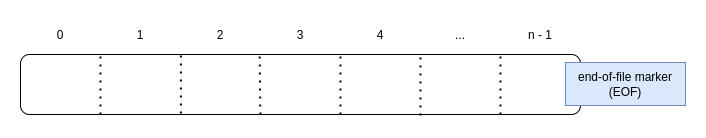
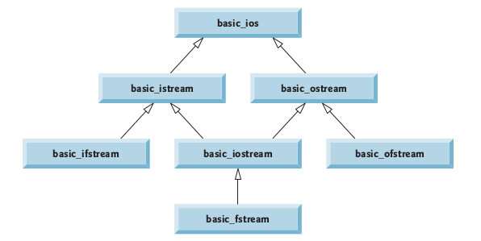

# C++: Concepts of Object-Oriented Programming

## Contents

1. [Introduction](#Introduction)
2. [Principles of OOP](#Principles-of-OOP)
    1. [Encapsulation](#Encapsulation)
    2. [Abstraction](#Abstraction)
    3. [Inheritance](#Inheritance)
    4. [Polymorphism](#Polymorphism)
3. [Generic Programming](#Generic-Programming)
    1. [Function Templates](#Function-Templates)
    2. [Class Templates](#Class-Templates)
    3. [Class Template Specializations](#Class-Template-Specializations)
    4. [Nontype Parameters and Default Types](#Nontype-Parameters-and-Default-Types)
    5. [Class Template Specializations Summarized](#Class-Template-Specializations-Summarized)
    6. [Limitations of Templates in C++03](#Limitations-of-Templates-in-C03)
4. [Exception Handling](#Exception-Handling)
    1. [Exceptions in C++ library](#Exceptions-in-C-library)
    2. [Extending C++ Exception Hierarchy](#Extending-C-Exception-Hierarchy)
5. [Stream IO](#Stream-IO)
    1. [Stream Output](#Stream-Output)
    2. [Stream Input](#Stream-Input)
        1. [`cin` and strings](#`cin`-and-strings)
        2. [Stream Management Functions](#Stream-Management-Functions)
    3. [Unformatted I/O](#Unformatted-I/O)
    4. [Stream Manipulators]()
    5. [Stream Error States](#Stream-Error-States)
    6. [`std::cin` and handling invalid input](#`std::cin`-and-handling-invalid-input)
6. [File Processing](#File-Processing)
    1. [Data Hierarchy](#Data-Hierarchy)
    2. [Files and Streams](#Files-and-Streams)
    3. [Sequential Files](#Sequential-Files)
    4. [Unformatted File I/O](#Unformatted-File-I/O)
    5. [Random Access Files](#Random-Access-Files)
7. [References](#References)
7. [Appendix](#Appendix)


## Introduction

The fundamental principles of good software engineering are

1. separating interface from implementation
2. hiding implementation details

These principles form the very foundation of the Object Oriented paradigm. Some of the advantages of adopting OO paradigm of development are:

- greater productivity, better quality of software and lesser maintenance cost.
- concepts like inheritance, eliminate redundant code and extend the use of existing classes resulting in better **software reusability**.
- encapsulation and abstraction help maintain an internal state, only accessible via public interface, hence ensuring a **simplified interface** description and **data security**.

## Principles of OOP

The object oriented programming stands on four pillars namely encapsulation, abstraction, inheritance and polymorphism. Although these concepts may somehow be enforced in other programming paradigms, however OOP is specifically designed to enforce these concepts through basic building blocks: classes and objects.

### Encapsulation

Encapsulation is achieved when each object keeps its state **private**, inside a class. Other objects don’t have direct access to this state.  Instead, they can only call a list of public functions — called methods.

So, the object manages its own state via methods — and no other class  can touch it unless explicitly allowed. If you want to communicate with  the object, you should use the methods provided. But (by default), you  can’t change the state.


### Abstraction

Abstraction can be thought of as a natural extension of encapsulation. Applying abstraction means that each object should **only** expose a high-level mechanism for using it. This mechanism should hide internal implementation details. It should only reveal operations relevant for the other objects.


### Inheritance

Inheritance is the ability of one object to acquire some/all properties of another object. For example, a child inherits the traits of his/her parents.  With inheritance, **re-usability** is a major advantage.

Objects are often very similar and share common logic. But they’re not **entirely** the same. So how do we **reuse** the common logic and extract the unique logic into a separate class? One way to achieve this is **inheritance**. It means that you create a (child) class by deriving from another (parent) class. This way, we form a hierarchy. The child class reuses all fields and methods of the parent class (common part) and can implement its own (unique part).


### Polymorphism

Polymorphism means designing objects to **share behaviors**. Using inheritance, objects can override shared parent behaviors, with  specific child behaviors. Polymorphism allows the same method to execute different behaviors in two ways: method overriding and method  overloading.

Runtime polymorphism uses method overriding. In method overriding, a  child class can provide a different implementation than its parent  class.

When we think about classes, we assume that programs will create objects of that type. However, there are cases in which it’s useful to define classes from which you never intend to instantiate any objects. Such classes are called **abstract classes**. An abstract class provides a base class from which other classes can inherit. Derived classes, called **concrete classes**, can be used to instantiate objects and define every member function they declare.

When a base class pointer to a derived class object calls a function, it always executes the base class function. But if the function is defined as `virtual` in the base class, then the overridden copy in the respective derived class is called.  

>With virtual functions, the type of the object being pointed to, not the type of the handle, determines which version of a virtual function to invoke.

Choosing the appropriate function to call at execution time (rather than at compile time) is known as **dynamic binding** or **late binding**.

Once a function is defined as `virtual` in the base class, its overridden copy in the derived class retains it's `virtual` status even if not declared explicitly.


[^ top](#Contents)

## Generic Programming

C++ requires us to declare variables, functions, and most other kinds of entities using specific types. However, a lot of code looks the same for different types. For example, the implementation of the algorithm *quick sort* looks structurally the same for different data structures, such as arrays of `int`s or `vector`s of `string`s, as long as the contained types can be compared to each other.

If a programming language doesn’t support a special language feature for this kind of **genericity**, you only have bad alternatives:

1. You can implement the same behavior again and again for each type that needs this behavior.
2. You can write general code for a common base type such as `Object` or `void*`.
3. You can use special preprocessors.

Most modern programming languages provide features to implement this paradigm called **Generic Programming**. It is a style of programming in which algorithms are written in terms of types *to-be-specified-later* that are then instantiated when needed for specific types provided as parameters. In C++ it's implemented through **Templates** which bring in some powerful *software reuse* features. **Function templates** and **class templates** enable us to specify, with a single code segment, an entire range of related (overloaded) functions—called **function-template specializations**—or an entire range of related classes—called **class-template specializations**. This technique is called **generic programming**.

### Function Templates

Overloaded functions normally perform similar or identical operations on different types of data. If the operations are identical for each type, they can be expressed more compactly and conveniently using function templates. Based on the argument types provided explicitly or inferred from calls to this function, the compiler generates separate source-code functions (i.e., function-template specializations) to handle each function call appropriately. All function-template definitions begin with keyword `template` followed by a list of **template parameters** to the function template enclosed in angle brackets ( `<` and `>` ); each template parameter that represents a type must be preceded by either of the interchangeable keywords `class` or `typename` , as in

```c++
template< typename T >
// or
template< class ElementType >
// or
template< typename BorderType, typename FillType >
```

The type template parameters of a function-template definition are used to specify the types of the arguments to the function, to specify the return type of the function and to declare variables within the function. For example:

```c++
template< typename T >
T addNumbers( const T a, const T b )
{
  return ( a + b );
}
```

### Class Templates

Imagine the concept of a stack (a data structure in which we can store and retrieve data in *last-in first-out* order) independent of a storage type (generic). We can instantiate an object that is a type-specific version of this generic stack. For this purpose C++ provides class templates, also called **parametrized types**, because they require oner or more type parameters to specify the customization to form a class-template specialization. 

A class-template definition is preceded by a header

```c++
template< typename T >
```

to specify a class-template definition with **type parameter** `T` which acts as a placeholder for the type of the Stack class to be created.

For example:

```c++
template< typename T >
class Stack
{
  public:
  	Stack( int = 10 );
  	~Stack() { delete [] stackPtr; }
  	bool push( const T & );
  	bool pop( T & );
  	bool isEmpty() const { return top == -1; }
  	bool isFull() const { return top == size - 1; }
  private:
  	int size;
  	int top;
  	T *stackPtr;
};

template< typename T >
Stack< T >::Stack( int s ): 
		size( s > 0 ? s : 10 ), //validate size
		top( -1 ), // Stack initially empty
		stackPtr( new T[ size ] ) // allocate memory for elements
{ // empty body }

template< typename T >
bool Stack< T >::push( const T &pushValue )
{
  if ( !isFull() )
  {
  	stackPtr[ ++top ] = pushValue; // place item on Stack
  	return true; // push successful
  }
  return false; // push unsuccessful
}

template< typename T >
bool Stack< T >::pop( T &popValue )
{
  if ( !isEmpty() )
  {
    popValue = stackPtr[ top-- ]; // remove item from Stack
    return true; // pop successful
  }
  return false;
}
```

The member-function definitions of a class template are function templates. The member-function definitions that appear outside the class template definition each begin with the header

```c++
template< typename T >
```

The binary scope resolution operator is used with the class-template name `Stack< T >`  to tie each member-function definition to the class template’s scope.

### Class Template Specializations

Every object instantiation from a class template forms a specialization of it's generic definition. For example for an `Array` class template defined as

```c++
template<typename T>
class Array { };
```

an object instantiation like `Array< int > intArray;` creates a concrete form of the class template called **class-template specialization**. A number of specializations for a class template can be aliased using `typedef` statement in the header definition like

```c++
...
typedef Array< int > IntegerArray;
typedef Array< float > FloatArray;
typedef Array< double > DoubleArray;
```

C++ standard library defines many such `typedef`s for its class-template specializations. For example

```cpp
// class basic_string specialized for single byte character
typedef std::basic_string<char> std::string;
// class basic_string specialized for two byte (wide) character
typedef	std::basic_string<wchar_t> std::wstring;
```


### Nontype Parameters and Default Types

Class template declaration like `template< typename T > class Stack { };` use only a type parameter (T) in the header. It’s also possible to use non-type template parameters, which can have default arguments and are treated as `const`s. For example,

```c++
template< typename T, int elements > // nontype parameter elements
```

Then, a declaration such as

```c++
Stack< double, 100 > mostRecentSalesFigures;
```

could be used to instantiate (at compile time) a 100-element Stack *class-template specialization* of double values. The class definition then might contain a private data member with an array declaration such as

```c++
T stackHolder[ elements ]; // array to hold Stack contents
```

In addition, a type parameter can specify a **default type**. For example,

```c++
template< typename T = string > // defaults to type string
```

might specify that a `Stack` contains string objects by default. Then, a declaration such as

```c++
Stack<> jobDescriptions;
```

could be used to instantiate a `Stack` class-template specialization of `string` s. This class-template specialization would be of type `Stack< string >` .

### Class Template Specializations Summarized

Summarizing the syntax of class-template definitions:

```c++
// (1) defines a class template
template<typename T> class A { }; 

// (2) defines a class template explicit specialization 
template<> class A<int> { };

// (3) defines a class template partial specialization
template<typename T> class A<T*> { };

// (4) explicitly instantiates A<char>. 
template class A<char>;

// (5) implicitly instantiates A<short> (because of the member declaration)
struct D { A<short> a; };

// (6) defines a class template that defaults to type string
template< typename T = string > class Array { };
// defines a class template default type specialization
Array<> stringArray;

// (7) defines a class template with nontype parameter
template< typename T, int elements > Stack { };
// defines a specialization from a nontype parameter
Stack< double, 100 > mostRecentSalesFigures;

// (8) defines a class template with default valued nontype parameter
template< typename T, int elements = 10 > Stack { };
// defines a specialization with the default number of elements
Stack< string > recentPosts;
```


### Limitations of Templates in C++03

#### Template class can't define a default constructor

As type deduction doesn't work for default argument in template classes, the workaround is to define an extra constructor without any parameters. For example:

```c++
template<typename T>
class Foo
{
public:
  Foo() {
    // assign some default value
  }
  Foo(const T&);
  // ...

  private:
	  T value_;
};
```


#### Tell your compiler which instantiations to make while compiling

In case of syntax following standards prior to C++11, you need to tell your compiler which instantiations to make while it is compiling `.cpp` file defining your template function or class.

As an example, consider the header file `foo.h` which contains the following template function declaration:

```c++
// File "foo.h"
template<typename T>
extern void foo();
```

Now suppose file `foo.cpp` actually defines that template function:

```c++
// File "foo.cpp"
#include <iostream>
#include "foo.h"
template<typename T>
void foo()
{
  std::cout << "Here I am!\n";
}
```

Suppose file `main.cpp` uses this template function by calling `foo<int>()`:

```c++
// File "main.cpp"
#include "foo.h"
int main()
{
  foo<int>();
  // ...
}
```

If you compile and (try to) link these two `.cpp` files, most compilers will generate **linker errors**.

There are two solutions for this. 

1. physically move the definition of the template function into the .h file, even if it is not an `inline` function.

2.  leave the definition of the template function in the .cpp file and simply add the line `template void foo<int>();` to that file. If you can’t modify `foo.cpp`, simply create a new `.cpp` file such as `foo-impl.cpp` as follows:

    ```c++
    // File "foo-impl.cpp"
    #include "foo.cpp"
    template void foo<int>();
    ```

    Notice that `foo-impl.cpp` `#include`s a `.cpp` file, not a `.h` file.

#### Defining global friend functions as function templates

The snag happens when the compiler sees the `friend` lines way up in the class definition proper. At that moment it does not yet know the `friend` functions are themselves templates; it assumes they are non-templates like this:

```c++
Foo<int> operator+ (const Foo<int>& lhs, const Foo<int>& rhs){ /*...*/ }
std::ostream& operator<< (std::ostream& o, const Foo<int>& x){ /*...*/ }
```

When you call the `operator+` or `operator<<` functions, this assumption causes the compiler to generate a call to the *non*-template functions, but the linker will give you an “undefined external” error because you never actually defined those *non*-template functions. The solution is to convince the compiler *while it is examining the class body proper* that the `operator+` and `operator<<` functions are themselves templates.

There are several ways to do this; one simple approach is to **pre-declare** each template friend function *above* the definition of template class `Foo`:

```c++
// pre-declare the template class itself
template<typename T> class Foo;
// pre-declare the friend functions
template<typename T> Foo<T> operator+ (const Foo<T>& lhs, const Foo<T>& rhs);
template<typename T> std::ostream& operator<< (std::ostream& o, const Foo<T>& x);
```

Also you add `<>` in the `friend` lines, as shown:

```c++
#include <iostream>
template<typename T>
class Foo
{
  public:
    Foo(const T& value = T());
    friend Foo<T> operator+ <> (const Foo<T>& lhs, const Foo<T>& rhs);
    friend std::ostream& operator<< <> (std::ostream& o, const Foo<T>& x);

  private:
	  T value_;
};
```

After the compiler sees that magic stuff, it will be better informed about the `friend` functions.

Another approach is to *define* the `friend` function within the class body at the same moment you declare it to be a `friend`. For example:

```c++
#include <iostream>
template<typename T>
class Foo {
public:
  Foo(const T& value = T());
  friend Foo<T> operator+ (const Foo<T>& lhs, const Foo<T>& rhs)
  {
    // ...
  }
  friend std::ostream& operator<< (std::ostream& o, const Foo<T>& x)
  {
    // ...
  }
private:
  T value_;
};
```

[top](#Contents)

## Exception Handling

An exception is an indication of a problem that occurs during a program’s execution. The name “exception” implies that the problem occurs infrequently—if the “rule” is that a statement normally executes correctly, then the “exception to the rule” is that a problem occurs. Exception handling enables you to create applications that can resolve (or handle) exceptions. In many cases, handling an exception allows a program to continue executing as if no problem had been encountered. A more severe problem could prevent a program from continuing normal execution, instead requiring the program to notify the user of the problem before terminating in a controlled manner. The features presented in this chapter enable you to write robust and fault-tolerant programs that can deal with problems that may arise and continue executing or terminate gracefully.

Program logic frequently tests conditions that determine how program execution proceeds. Consider the following pseudocode:

```
Perform a task
If the preceding task did not execute correctly
	Perform error processing
Perform next task
If the preceding task did not execute correctly
	Perform error processing
…
```

> Exception handling enables you to remove error-handling code from the “main line” of the program’s execution, which improves program clarity and enhances modifiability.

### Exceptions in C++ library

The header `<exception>` provides several classes and functions related to exception handling in C++ programs. Most important of which is [`exception`](https://en.cppreference.com/w/cpp/error/exception), base class for exceptions thrown by the standard library components.

Several convenience classes are predefined in the header `<stdexcept>` to report particular error conditions. These classes can be divided into two categories: *logic* errors and *runtime* errors. Logic errors are a consequence of faulty logic within the program and may be preventable. Runtime errors are due to events beyond the scope of the program and can not be easily predicted.

| Defined in header `<stdexcept>`                              |                                                              |
| ------------------------------------------------------------ | ------------------------------------------------------------ |
| [logic_error](https://en.cppreference.com/w/cpp/error/logic_error) | exception class to indicate violations of logical preconditions or class invariants (class) |
| [invalid_argument](https://en.cppreference.com/w/cpp/error/invalid_argument) | exception class to report invalid arguments (class)          |
| [domain_error](https://en.cppreference.com/w/cpp/error/domain_error) | exception class to report domain errors (class)              |
| [length_error](https://en.cppreference.com/w/cpp/error/length_error) | exception class to report attempts to exceed maximum allowed size (class) |
| [out_of_range](https://en.cppreference.com/w/cpp/error/out_of_range) | exception class to report arguments outside of expected range (class) |
| [runtime_error](https://en.cppreference.com/w/cpp/error/runtime_error) | exception class to indicate conditions only detectable at run time (class) |
| [range_error](https://en.cppreference.com/w/cpp/error/range_error) | exception class to report range errors in internal computations (class) |
| [overflow_error](https://en.cppreference.com/w/cpp/error/overflow_error) | exception class to report arithmetic overflows (class)       |
| [underflow_error](https://en.cppreference.com/w/cpp/error/underflow_error) | exception class to report arithmetic underflows (class)      |


C++ provides `try` blocks to enable exception handling. A `try` block consists of keyword `try` followed by braces ( `{}` ) that define a block of code in which exceptions might occur. The `try` block encloses statements that might cause exceptions and statements that should be skipped if an exception occurs.

Exceptions are processed by **catch handlers** (also called **exception handlers**), which catch and handle exceptions. At least one catch handler must immediately follow each try block. Each catch handler begins with the keyword `catch` and specifies in parentheses an **exception parameter** that represents the type of exception the catch handler can process ( e.g. logic_error). Exceptions are always caught by reference.

### Extending C++ Exception Hierarchy

For example, we can implement a divide-by-zero exception like:

```c++
// Class DivideByZeroException definition.
#include <stdexcept> // contains runtime_error
using namespace std;

/**
	* DivideByZeroException
	* exception object should be thrown by functions
	* upon detecting division-by-zero exceptions
	*/
class DivideByZeroException : public runtime_error 
{
public:
   // constructor specifies default error message
   DivideByZeroException()
      : runtime_error( "attempted to divide by zero" ) {}
}; // end class DivideByZeroException

```

This class can be used to throw an exception in a situation like:

```c++
// A simple exception-handling example that checks for
// divide-by-zero exceptions.
#include <iostream>
#include "DivideByZeroException.h" // exception class 
using namespace std;

// perform division and throw DivideByZeroException
// object if divide-by-zero exception occurs
double quotient( int numerator, int denominator )
{
   // throw DivideByZeroException if trying to
   // divide by zero
   if ( denominator == 0 )
     	// terminate function
      throw DivideByZeroException(); 

   // return division result
   return
     static_cast< double >( numerator ) / denominator;
} // end function quotient

int main()
{
   int number1; // user-specified numerator
   int number2; // user-specified denominator
   double result; // result of division

   cout << "Enter two integers (end-of-file to end): ";

   // enable user to enter two integers to divide
   while ( cin >> number1 >> number2 ) 
   {
      // try block contains code that might
     	// throw exception and code that should
     	// not execute if an exception occurs
      try 
      {
         result = quotient( number1, number2 );
         cout << "The quotient is: " << result << endl;
      } // end try
      catch ( DivideByZeroException &
             		divideByZeroException ) 
      {
         cout << "Exception occurred: " 
            << divideByZeroException.what() << endl;
      } // end catch

      cout << "\nEnter two integers "
        	<< "(end-of-file to end): ";
   } // end while

   cout << endl;
} // end main

```

Output

```
Enter two integers (end-of-file to end): 100 7
The quotient is: 14.2857
Enter two integers (end-of-file to end): 100 0
Exception occurred: attempted to divide by zero
Enter two integers (end-of-file to end): ^C
```


[^ top](#Contents)

## Stream I/O

C++ I/O occurs in **streams**, which are sequences of bytes. In input operations, the bytes flow from a **device** (e.g., a keyboard, a disk drive, a network connection, etc.) to **main memory**. In output operations, bytes flow from main memory to a device (e.g., a display screen, a printer, a disk drive, a network connection, etc.). An application may associate any meaning or abstraction with these bytes. The bytes could represent characters, raw data, graphics images, digital speech, digital video or any other information that has some meaning for an application. The system I/O mechanisms should transfer bytes from devices to memory (and vice versa) *consistently* and *reliably*. The time these transfers take, depending on the nature of the target device (e.g. mechanical disk, tape drive, printer etc.), can be much greater than the time the processor requires to manipulate data internally. Thus, I/O operations require careful planning and tuning to ensure optimal performance. C++ provides both “low-level” (i.e., unformatted I/O) and “high-level” (i.e., formatted I/O) I/O capabilities. 

- **Low-level I/O** capabilities specify that:
    - some number of bytes should be transferred device-to-memory or memory-to-device.
    - the individual byte is the item of interest.
    - provide high-speed, high-volume transfers
    - but are not particularly convenient for programs with higher level of abstraction. 
- **Higher-level I/O** capabilities:
    - formatted I/O, in which bytes are grouped into meaningful units (integers, floating-point numbers, characters, strings and user-defined types).
    - type-oriented capabilities are satisfactory for most I/O other than high-volume file processing.
    - programmers generally prefer to deal with a higher-level view of data

In the past, the C++ classic stream libraries enabled input and output of `chars`. Because a `char` normally occupies one byte, it can represent only a limited set of characters (such as those in the ASCII character set). However, many languages use alphabets that contain more characters than a single-byte char can represent. The ASCII character set does not provide these characters; the **Unicode® character set** does. Unicode is an extensive international character set that represents the majority of the world’s “*commercially viable*” languages, mathematical symbols and much more. For more information on Unicode, visit [www.unicode.org](www.unicode.org).

C++ includes the **standard stream libraries**, which enable developers to build systems capable of performing I/O operations with Unicode characters. For this purpose, C++ includes an additional character type called `wchar_t`, which can store 2-byte Unicode characters. The C++ standard also redesigned the classic C++ stream classes, which processed only chars, as class templates with separate **specializations** for processing characters of types `char` and `wchar_t`, respectively.

The `<iostream>` header file defines the `cin`, `cout`, `cerr` and `clog` objects, which correspond to the standard input stream, the standard output stream, the unbuffered standard error stream and the buffered standard error stream, respectively. Both unformatted and formatted-I/O services are provided.

| Stream Object | description                                 |
| :------------ | :------------------------------------------ |
| `cin`         | standard input stream                       |
| `cout`        | standard output stream                      |
| `cerr`        | standard error (output) stream (unbuffered) |
| `clog`        | standard logging (output) stream (buffered) |

The iostream library provides many templates for handling common I/O operations. Each template has a predefined template specialization that enables char I/O. In addition, the `iostream` library provides a set of typedefs that provide aliases for these template specializations. The typedef specifier declares synonyms (aliases) for previously defined data types. For example, 

| Class Template   | `typedef` Specialization | Description                                        |
| ---------------- | ------------------------ | -------------------------------------------------- |
| `basic_istream`  | `istream`                | specialized `char`  stream-input                   |
| `basic_ostream`  | `ostream`                | specialized `char`  stream-output                  |
| `basic_iostream` | `iostream`               | specialized `char`  stream-input and stream-output |


### Stream Output

C++ determines data types automatically—an improvement over C. This feature sometimes “gets in the way.” For example, suppose we want to print the address stored in a `char *` pointer. The `<<` operator has been overloaded to output a `char *` as a null-terminated string. To output the address, you can cast the `char *` to a `void *` (this can be done to any pointer variable).

```c++
const char *const word = "again";
// display value of char *, then display value of char *
// static_cast to void *
cout << "Value of word is: " << word << endl
<< "Value of static_cast< void * >( word ) is: "
<< static_cast< void * >( word ) << endl;
```


We can use the `put` member function to output characters. For example, the statement

```c++
cout.put( 'C' ).put( 'A' ).put( 'T' ).put( '\n' );
```

displays CAT a single character at a time followed by a newline character. These are called **cascaded function calls** which are made possible by the `ostream` reference returned by the `put` function. The put function also may be called with a numeric expression that represents an ASCII value, as in the following statement

```c++
cout.put( 65 );
```

which outputs A .

### Stream Input

[ref^](https://en.cppreference.com/w/cpp/io/basic_istream)

C++ `iostream` library provides standard stream input object `cin` where the standard input by default is the keyboard. For formatted input operations, `cin` is used together with the extraction operator (`>>`) then followed by the variable where the extracted data is stored. In this case, note that the characters introduced using the keyboard are only transmitted to the program when the `ENTER` (or `RETURN`) key is pressed.

```c++
int age;
cin >> age;
```

The extraction operation on `cin` uses the type of the variable after the `>>` operator to determine how it interprets the characters read from the input; if it is an integer, the format expected is a series of digits, if a string a sequence of characters, etc. Pretty simple, right? What happens in the example above if the user enters something else that cannot be interpreted as an integer? Well, in this case, the extraction operation fails. And this, by default, lets the program continue without setting a value for variable, producing undetermined results if the value of the variable is used later.

This is very poor program behavior. Only very simple programs should rely on values extracted directly from `cin` without further checking. A little later we will see how *stringstreams* can be used to have better control over user input.

#### `cin` and strings

The extraction operator can be used on `cin` to get strings of characters. However, `cin` extraction always considers spaces (whitespaces, tabs, new-line...) as terminating the value being extracted, and thus extracting a string means to always extract a single word, not a phrase or an entire sentence.

`basic_istream` provides functions specialized to input characters and strings. Most common of these are `get` and `getline`.

Function `get` has multiple variations for different scenarios. For example,

| Function                                                     | Description                                                  |
| ------------------------------------------------------------ | ------------------------------------------------------------ |
| `int_type get();`                                            | inputs one character from the<br/>designated stream (including<br/>white-space characters and other<br/>non-graphic characters, such as the<br/>key sequence that represents end-of-file) |
| `basic_istream& get( char_type& ch );`                       | a character reference to read input                          |
| `basic_istream& get(`<br/>        `char_type* s,`<br/>        `std::streamsize count );` | a character array to read input and<br/>a size limit<br/>    |
| `basic_istream& get(`<br/>        `char_type* s,`<br/>        `std::streamsize count`<br/>        `char_type delim );` | a character array to read input and<br/>a size limit<br/>a character delimiter (with default value '\n' ) |

The fourth version of `get` takes three arguments—a character array, a size limit and a delimiter (with default value `'\n'` ). This version reads characters from the input stream. It either reads one fewer than the specified maximum number of characters and terminates or terminates as soon as the *delimiter* is read. A **null character is inserted to terminate the input string** in the character array used as a buffer by the program. The **delimiter is not placed in the character array but does remain in the input stream** (the delimiter will be the next character read). **Thus, the result of a second consecutive get is an empty line**, unless the delimiter character is removed from the input stream (possibly with `cin.ignore()` ).

As a function with no arguments:

```c++
int character; // use int, because char cannot represent EOF

// use get to read each character; use put to display it
while ( ( character = cin.get() ) != EOF )
	cout.put( character );
```

As a function with three arguments and last one optional:

```c++
// create a char array with 80 elements
const int SIZE = 80;
char buffer1[ SIZE ];
char buffer2[ SIZE ];

// use cin.get to input characters into buffer
cin.get( buffer1, SIZE );
// or change the delimiter if needed
cin.get( buffer2, SIZE, '|' );
```

Member function `getline` operates similarly to the third version of the get member function and inserts a null character after the line in the character array. The `getline` function **removes the delimiter from the stream** (i.e., reads the character and discards it), but **does not store it in the character array**.

Looking at the available variations of the function `getline`:

| Function                                                     | Description                                                  |
| ------------------------------------------------------------ | ------------------------------------------------------------ |
| `basic_istream& getline(`<br/>        `char_type* s,`<br/>        `std::streamsize count );` | a character array to read input and<br/>a size limit<br/>    |
| `basic_istream& getline(`<br/>        `char_type* s,`<br/>        `std::streamsize count,`<br/>        `char_type delim );` | a character array to read input and<br/>a size limit<br/>a character delimiter (with default value '\n' ) |

For example

```c++
const int SIZE = 80;
char buffer[ SIZE ]; // create array of 80 characters
// input characters in buffer via cin function getline
cout << "Enter a sentence:" << endl;
cin.getline( buffer, SIZE );
```

#### Stream Management Functions

`istream` provides function to manage the input stream.

| Function  | Description                                                  |
| --------- | ------------------------------------------------------------ |
| `ignore`  | Extracts and discards characters from the input stream until and including `delim`. |
| `putback` | Puts a character `ch` back to the input stream so the next extracted character will be `ch`. |
| `peek`    | reads the next character in input stream without extracting it |


### Unformatted I/O

Unformatted input/output is performed using the `read` and `write` member functions of `istream` and `ostream` , respectively. Member function read input bytes to a character array in memory; member function write outputs bytes from a character array. These bytes are not formatted in any way. The `write` function outputs the designated number of characters from a buffer (including null characters). The `read` member function inputs a designated number of characters into a character array. If fewer than the designated number of characters are read, `failbit` (discussed later) is set. Member function `gcount` reports the number of characters read by the last input operation. As an example:

```c++
const int SIZE = 80;
char buffer[ SIZE ]; // create array of 80 characters

// use function read to input characters into buffer
cout << "Enter a sentence:" << endl;
cin.read( buffer, 20 );

// use functions write and gcount to display buffer characters
cout << endl << "The sentence entered was:" << endl;
cout.write( buffer, cin.gcount() );
cout << endl;
```


### Stream Manipulators

The `<iomanip>` header declares services useful for performing formatted I/O with socalled parameterized stream manipulators, such as `setw` and `setprecision`.

| Function       | Type                 | Description                                                  |
| -------------- | -------------------- | ------------------------------------------------------------ |
| `left`         | alignment            | Left justify output in a field. Padding characters appear to the right if necessary. |
| `right`        | alignment            | Right justify output in a field. Padding characters appear to the left if necessary. |
| `internal`     | alignment            | a number’s sign should be left justified in a field and a number’s magnitude should be right justified in that same field |
| `fill`         | alignment            | member function to set padding character                     |
| `setfill`      | alignment            | stream manipulator to set padding character                  |
| `width`        | field width          | member function to set field width to print a value          |
| `setw`         | field width          | stream manipulator to set field width to print a value       |
| `dec`          | integral, sticky^!^  | set the base to hexadecimal (base 16)                        |
| `oct`          | integral, sticky     | set the base to octal (base 8)                               |
| `hex`          | integral, sticky     | set the base to decimal (base 10)                            |
| `setbase`      | integral, sticky     | takes one integer argument of 10 , 8 , or 16 to set the base ^+^ |
| `showbase`     | integral             | the base of a number is to be output ahead of the number<br/>(a leading 0 for octals; a leading 0x or 0X for hex).<br/>resets with `noshowbase`. |
| `showpoint`    | fp precision, sticky | floating-point numbers should be output with a decimal<br/>point. resets with `noshowpoint`. |
| `precision`    | fp precision, sticky | stream manipulator to set floating-point precision,<br/>a call to `precision` with no argument returns the <br/>current precision setting. |
| `setprecision` | fp precision, sticky | member function to set floating-point precision              |
| `fixed`        | fp precision, sticky | output a floating-point value in fixed-point notation with <br/>a specific number of digits to the right of the decimal point. |
| `scientific`   | fp precision, sticky | output a floating-point value in scientific notation.        |
| `uppercase`    | numeric, sticky      | uppercase letters (i.e., X and A through F ) should be <br/>used in a hexadecimal integer and that uppercase E <br/>should be used when representing a floating-point value <br/>in scientific notation. resets with `nouppercase` |
| `showpos`      | numeric, sticky      | positive numbers should be preceded by a plus sign (+).<br/>This setting is reset with stream manipulator `noshowpos` . |
| `boolalpha`    | boolean, sticky      | boolean values should be printed as alphabetic aliases (true / false). reset with `noboolaplha` |

( **!** ) sticky means the value remains the same until changed explicitly.

( **+** ) Using `setbase` (or any other parameterized manipulator) requires the inclusion of the `<iomanip>` header file.

#### Integral base manipulators

```c++
// use hex stream manipulator to show hexadecimal number
int number = 42;

// use oct stream manipulator to show octal number
cout << "number: " << dec << number
  	<< "\nin octal is: " << oct << number << endl;

// use setbase stream manipulator to show decimal number
cout << "\nin hex is: " << hex << number
		<< setbase( 10 )
  	<< " in decimal is: " << number << endl;
```

#### Floating-point precision

```c++
#include <iostream>
#include <iomanip>
#include <cmath>
using namespace std;
int main()
{
  double root2 = sqrt( 2.0 ); // calculate square root of 2
  int places; // precision, vary from 0-9
  int savedPrecision = cout.precision(); // save existing value
  
  cout << "Square root of 2 with precisions 0-9." << endl
  	<< "Precision set by ios_base member function "
    << "precision:" << endl;
  cout << fixed; // use fixed-point notation
  // display square root using ios_base function precision
  for ( places = 0; places <= 9; places++ )
  {
    cout.precision( places );
    cout << root2 << endl;
  } // end for
  
  cout << "\nPrecision set by stream manipulator "
  	<< "setprecision:" << endl;
  // set precision for each digit, then display square root
  for ( places = 0; places <= 9; places++ )
  	cout << setprecision( places ) << root2 << endl;
  
  cout.precision(savedPrecision); // resotre the original value
  return 0;
} // end main
```

#### Decimal Point

```c++
// display double values with default stream format
cout << "Before using showpoint" << endl
<< "9.9900 prints as: " << 9.9900 << endl
<< "9.9000 prints as: " << 9.9000 << endl
<< "9.0000 prints as: " << 9.0000 << endl << endl;

// display double value after
cout << showpoint
<< "After using showpoint" << endl
<< "9.9900 prints as: " << 9.9900 << endl
<< "9.9000 prints as: " << 9.9000 << endl
<< "9.0000 prints as: " << 9.0000 << endl;
```

#### Justification

```c++
int x = 12345;
// display x right justified (default)
cout << "Default is right justified:" << endl
	<< setw( 10 ) << x;
// use left manipulator to display x left justified
cout << "\n\nUse std::left to left justify x:\n"
	<< left << setw( 10 ) << x;
// use right manipulator to display x right justified
cout << "\n\nUse std::right to right justify x:\n"
	<< right << setw( 10 ) << x << endl;
// display value with internal spacing and plus sign
cout << "\n\nUse std::internal to right justify x with std::showpos:\n"
  << internal << showpos << setw( 10 ) << x << endl;
```

#### Padding, Justification, Alignment, Uppercase, 

```c++
int x = 10, rows = 10;
// display x
cout << x 
  << " printed as int, left justified, default pad character (space)\n"
  << "and as hex, uppercase, right justified, _ pad character\n"
  << "and squared as dec, internal justified, ^ pad character, "
  << "with + sign\n:"
  << endl;

// print table header
cout << setw(15) << left << "Number"
  << setw(15) << right << "Hex"
  << "  "
  << setw(15) << internal << "Square"
  << showbase // display with base
  << uppercase // display hex digits in uppercase
  << endl;
for( unsigned int count = 0; count < rows; count++ )
{
  // display with left justification
  cout << setw(15) << left << setfill(' ') << x
    // display using padded characters '_', right justified
    << setw(15) << right << setfill('_') << hex << x
    << dec << "  "
    // display as hex using '^' padded characters, internal justified
    // and show positive (+) sign
    << setw(15) << internal << showpos << setfill('^') << ( x * x )
    // restore positive sign setting for next iteration
    << noshowpos << endl;
  // left shift value by 1 (= value * 2)
  x = x << 1;
}

```

#### Floating-Point, Fixed, Scientific Notation

```c++
unsigned int rows = 5;
double x = 1.2345e-10;
// print table header
cout << setw(15) << "Number"
  << setw(15) << "Sqrt Fixed"
  << setw(20) << "Sqrt Scientific"
  << setprecision(8) // set precision for floating point values
  << endl;
for( unsigned int count = 0; count < rows; count++ )
{
  double fpValue = sqrt( x );
  // 
  cout << setw(15) << x
    // display in fixed-point notation
    << setw(15) << fixed << fpValue
    // display in scientific notation
    << setw(20) << scientific << fpValue
    << endl;
  x *= 5;
}

```

#### Boolean Format

```c++
bool booleanValue = true;
// display default true booleanValue
cout << "booleanValue is " << booleanValue << endl;
// display booleanValue after using boolalpha
cout << "booleanValue (after using boolalpha) is "
	<< boolalpha << booleanValue << endl << endl;

cout << "switch booleanValue and use noboolalpha" << endl;

booleanValue = false; // change booleanValue
cout << noboolalpha << endl; // use noboolalpha
// display default false booleanValue after using noboolalpha
cout << "booleanValue is " << booleanValue << endl;
// display booleanValue after using boolalpha again
cout << "booleanValue (after using boolalpha) is "
	<< boolalpha << booleanValue << endl;
```

#### Setting and Resetting the Format State

```c++
// use cout flags function to save original format
ios_base::fmtflags originalFormat = cout.flags();

cout << showbase << oct << scientific; // change format
// display flags value, int and double values (new format)
cout << "The value of the flags variable is: " << cout.flags()
<< "\nPrint int and double in a new format:\n"
<< integerValue << '\t' << doubleValue << endl;

cout.flags( originalFormat ); // restore format
```


### Stream Error States


| Function  | Description                                                  |
| --------- | ------------------------------------------------------------ |
| `good`    | checks if no error has occurred i.e. I/O operations are available |
| `eof`     | checks if end-of-file has been reached                       |
| `fail`    | checks if an error has occurred                              |
| `bad`     | checks if a non-recoverable error has occurred               |
| `rdstate` | returns state flags                                          |
| `clear`   | modifies state flags                                         |

`rdstate` returns current stream error state. It is a bitmask type and can be a combination of the following constants (defined as `static const` in `ios::ios_base::`):

| Constant  | Explanation                                                  |
| --------- | ------------------------------------------------------------ |
| `goodbit` | no error                                                     |
| `badbit`  | irrecoverable stream error                                   |
| `failbit` | input/output operation failed (formatting or extraction error) |
| `eofbit`  | associated input sequence has reached end-of-file            |

#### Examples

```c++
#include <iostream>
#include <sstream>
#include <limits>
 
int main()
{
    std::istringstream input("1\n"
                             "some non-numeric input\n"
                             "2\n");
    for(;;) {
        int n;
        input >> n;
 
        if ( input.eof() || input.bad() )
        {
            break;
        }
      	else if ( input.fail() )
        {
            input.clear(); // unset failbit
          	// skip bad input to the max possible stream size
            input.ignore(
              std::numeric_limits<std::streamsize>::max(),
              '\n' );
        } 
      	else
        {
            std::cout << n << '\n';
        }
    }
}
```


### `std::cin` and handling invalid input

Programs with user interfaces requiring some form of input use `std::cin` to prompt the user. However, the C++ input library is so unrestricted that a user intentionally or unintentionally may enter anything. As a result, the programmers writing the application must consider how a user may **misuse** their program. A well written program that anticipates such misuse and handles these error conditions gracefully is said to be **robust**. 

> *robustness* is the ability of a *computer* system to cope with errors during execution and cope with erroneous input.
>
> – [*Robustness* (computer science)](https://en.wikipedia.org/wiki/Robustness_(computer_science))

When we use `operator>>` to get user input and put it into a  variable, this is called an “extraction”. The `>>` operator is accordingly called the extraction operator when used in this context.

When the user enters input in response to an extraction operation, that data is placed in a buffer inside of `std::cin`. A **buffer** (also called a data buffer) is simply a piece of memory set aside for  storing data temporarily while it’s moved from one place to another. In  this case, the buffer is used to hold user input while it’s waiting to  be extracted to variables.

When the extraction operator is used, the following procedure happens:

- If there is data already in the input buffer, that data is used for extraction.
- If the input buffer contains no data, the user is asked to input data for  extraction (this is the case most of the time). When the user hits  enter, a ‘`\n`’ character will be placed in the input buffer.
- `operator>>` extracts as much data from the input buffer as it can into the variable (ignoring any leading whitespace characters, such as spaces, tabs, or  ‘`\n`’).
- Any data that can not be extracted is left in the input buffer for the next extraction.

Extraction succeeds if at least one character is extracted from the  input buffer. Any unextracted input is left in the input buffer for  future extractions. For example:

```cpp
int x;
std::cin >> x;
# 5a
# x = 5
```

If the user enters “`5a`”, `5` will be extracted, converted to an integer, and assigned to variable `x`. “`a\n`” will be left in the input buffer for the next extraction.

Extraction fails if the input data does not match the type of the variable being extracted to. For example:

```cpp
int x;
std::cin >> x;
# b
# failbit is set
```

If the user were to enter ‘`b`’, extraction would fail because ‘b’ can not be extracted to an integer variable.

#### Validating input

The process of checking whether user input conforms to what the program is expecting is called **input validation**. There are three basic ways to do input validation:

- Inline (as the user types)
    - Prevent the user from typing invalid input in the first place.
- Post-entry (after the user types)
    - Let the user enter whatever they want into a string, then validate whether  the string is correct, and if so, convert the string to the final  variable format.
    - Let the user enter whatever they want, let `std::cin` and `operator>>` try to extract it, and handle the error cases.

The first style requires a synchronous character by character input (without being echoed to the screen) and printing only the validated characters. Unfortunately, `std::cin` doesn't support this style of validation.

Since strings do not have any restrictions on what characters can be  entered, extraction is guaranteed to succeed (though remember that  `std::cin` stops extracting at the first non-leading whitespace  character). Once a string is entered, the program can then parse the string to see if it is valid or not. Most often, we let `std::cin` and the extraction operator do the hard work. Under this method, we let the user enter whatever they want, have `std::cin` and `operator>>` try to extract it, and deal with the **fallout** if it fails.

##### A sample program

Consider the following calculator program without any error handling:

```cpp
#include <iostream>
using namespace std;

double getDouble()
{
    cout << "Enter a double value: ";
    double x;
    cin >> x;
    return x;
}

char getOperator()
{
    cout << "Enter one of the following: +, -, *, or /: ";
    char op;
    cin >> op;
    return op;
}

void printResult(double x, char operation, double y)
{
    switch (operation)
    {
    case '+':
        std::cout << x << " + " << y << " is " << x + y << '\n';
        break;
    case '-':
        std::cout << x << " - " << y << " is " << x - y << '\n';
        break;
    case '*':
        std::cout << x << " * " << y << " is " << x * y << '\n';
        break;
    case '/':
        std::cout << x << " / " << y << " is " << x / y << '\n';
        break;
    }
}

int main()
{
    double x = getDouble();
    char operation = getOperator();
    double y = getDouble();

    printResult(x, operation, y);

    return 0;
}
```

##### Types of invalid text input

We can generally separate input text errors into four types:

- Input extraction succeeds but the input is *meaningless to the program* (e.g. entering ‘k’ as your mathematical operator).
- Input extraction succeeds but the user enters *additional input* (e.g. entering ‘*q hello’ as your mathematical operator).
- Input *extraction fails* (e.g. trying to enter ‘q’ into a numeric input).
- Input extraction succeeds but the user *overflows a numeric value*.

Thus, to make our programs **robust**, whenever we ask the user for input, we ideally should determine whether each of the above can possibly occur,  and if so, write code to handle those cases.

##### Error case 1: Extraction succeeds but input is meaningless

This is the simplest case. Consider the following execution of the above program:

```
Enter a double value: 5
Enter one of the following: +, -, *, or /: k
Enter a double value: 7
```

The solution here is simple: do input validation. This usually consists of 3 steps:

1. Check whether the user’s input was what you were expecting.
2. If so, return the value to the caller.
3. If not, tell the user something went wrong and have them try again.

Here’s an updated `getOperator()` function that does input validation.

```cpp
char getOperator()
{
    while (true) // Loop until user enters a valid input
    {
        cout << "Enter one of the following: +, -, *, or /: ";
        char operation{};
        cin >> operation;

        // Check whether the user entered meaningful input
        switch (operation)
        {
        case '+':
        case '-':
        case '*':
        case '/':
            return operation; // return it to the caller
        default: // otherwise tell the user what went wrong
            cerr << "Oops, that input is invalid. Please try again.\n";
        }
    } // and try again
}
```

Here we’re using a while loop to continuously loop until the user provides valid input.

##### Error case 2: Extraction succeeds but with extraneous input

Consider the following execution of the above program:

```
Enter a double value: 5*7
```

What do you think happens next?

```
Enter a double value: 5*7
Enter one of the following: +, -, *, or /: Enter a double value: 5 * 7 is 35
```

The program prints the right answer, but the formatting is all messed up.

When the user enters “`5*7`” as input, it goes into the buffer. Then `operator>>` extracts the `5` to variable `x`, leaving “`*7\n`” in  the buffer. Next, the program prints “`Enter one of the following: +, -,  *, or /:`”. However, when the extraction operator was called, it sees  “`*7\n`” waiting in the buffer to be extracted, so it uses that instead of asking the user for more input. Consequently, it extracts the ‘`*`’  character, leaving “`7\n`” in the buffer.

After asking the user to  enter another double value, the “`7`” in the buffer gets extracted without asking the user. Since the user never had an opportunity to enter additional data and hit enter (causing a newline), the output prompts all run together on the same line.

Although the above program works, the execution is messy. It would be better if any extraneous characters entered were simply ignored.  Fortunately, it’s easy to ignore characters:

```cpp
std::cin.ignore(100, '\n');  // clear up to 100 characters out of the buffer, or until a '\n' character is removed
```

This call would remove up to 100 characters, but if the user entered  more than 100 characters we’ll get messy output again. To ignore all  characters up to the next ‘\n’, we can pass `std::numeric_limits<std::streamsize>::max()` to `std::cin.ignore()`. `std::numeric_limits<std::streamsize>::max()` returns the largest value that can be stored in a variable of type `std::streamsize`. Passing this value to `std::cin.ignore()` causes it to disable the count check.

To ignore everything up to and including the next ‘\n’ character, we call

```cpp
std::cin.ignore(std::numeric_limits<std::streamsize>::max(), '\n');
```

Because this line is quite long for what it does, it’s handy to wrap it in a function which can be called in place of `std::cin.ignore()`.

```cpp
#include <limits> // for std::numeric_limits
using namespace std;

void ignoreLine()
{
    cin.ignore(numeric_limits<streamsize>::max(), '\n');
}
```

Since the last character the user entered must be a ‘`\n`’, we can tell `std::cin` to ignore buffered characters until it finds a newline  character (which is removed as well).

Let’s update our `getDouble()` function to ignore any extraneous input:

```cpp
double getDouble()
{
    cout << "Enter a double value: ";
    double x;
    cin >> x;
    ignoreLine();
    return x;
}
```

Now our program will work as expected, even if we enter “5*7” for the  first input -- the 5 will be extracted, and the rest of the characters  will be removed from the input buffer.

##### Error case 3: Extraction fails

Now consider the following execution of our updated calculator program:

```
Enter a double value: a
```

You shouldn’t be surprised that the program doesn’t perform as expected, but how it **fails** is interesting:

```
Enter a double value: a
Enter one of the following: +, -, *, or /: Oops, that input is invalid.  Please try again.
Enter one of the following: +, -, *, or /: Oops, that input is invalid.  Please try again.
Enter one of the following: +, -, *, or /: Oops, that input is invalid.  Please try again.
```

and that last line keeps printing until the program is closed.

When the user enters ‘`a`’, that character is placed in the buffer. Then `operator>>` tries to extract ‘`a`’ to variable `x`, which is of type `double`. Since ‘`a`’ can’t be converted to a `double`, `operator>>` can’t do the extraction. Two things happen at this point: ‘`a`’ is left in the buffer, and `std::cin` goes into “failure mode”.

Once in “failure mode”, future requests for input extraction will  silently fail. Thus in our calculator program, the output prompts still print, but any requests for further extraction are ignored. This means that instead waiting for us to enter an operation, the input prompt is  skipped, and we get stuck in an infinite loop because there is no way to reach one of the valid cases.

Fortunately, we can detect whether an extraction has failed and fix it:

```cpp
if( cin.fail() ) // has a previous extraction failed?
{
    // yep, so let's handle the failure
    cin.clear(); // put us back in 'normal' operation mode
    ignoreLine(); // and remove the bad input
}

```

Because `std::cin` has a boolean conversion indicating whether the last input succeeded, it’s more idiomatic to write the above as following:

```cpp
if( ! cin ) // has a previous extraction failed?
{
    // yep, so let's handle the failure
    cin.clear(); // put us back in 'normal' operation mode
    ignoreLine(); // and remove the bad input
}

```

Let’s integrate that into our `getDouble()` function:

```cpp
double getDouble()
{
    while ( true ) // Loop until user enters a valid input
    {
        cout << "Enter a double value: ";
        double x;
        cin >> x;

        if( ! cin ) // has a previous extraction failed?
        {
            // yep, so let's handle the failure
            cin.clear(); // put us back in 'normal' operation mode
            ignoreLine(); // and remove the bad input
        }
        else // else our extraction succeeded
        {
            ignoreLine();
            return x; // so return the value we extracted
        }
    }
}
```

A failed extraction due to invalid input will cause the variable to be  zero-initialized. Zero initialization means the variable is set to `0`, `0.0`, `“”`, or whatever value 0 converts to for that type.

##### Error case 4: Extraction succeeds but the user overflows a numeric value

Consider the following simple example:

```cpp
#include <cstdint>
#include <iostream>

int main()
{
    std::int16_t x{}; // x is 16 bits, holds from -32768 to 32767
    std::cout << "Enter a number between -32768 and 32767: ";
    std::cin >> x;

    std::int16_t y{}; // y is 16 bits, holds from -32768 to 32767
    std::cout << "Enter another number between -32768 and 32767: ";
    std::cin >> y;

    std::cout << "The sum is: " << x + y << '\n';
    return 0;
}
```

What happens if the user enters a number that is too large (e.g. 40000)?

```
Enter a number between -32768 and 32767: 40000
Enter another number between -32768 and 32767: The sum is: 32767
```

In the above case, `std::cin` goes immediately into “failure mode”, but  also assigns the closest in-range value to the variable. Consequently, `x` is left with the assigned value of `32767`. Additional inputs are skipped, leaving y with the initialized value of 0. We can handle this  kind of error in the same way as a failed extraction.

##### Putting it all together

Here’s our example calculator, updated with a few additional bits of error checking:

```cpp
#include <iostream>
#include <limits>

void ignoreLine()
{
    std::cin.ignore(
      std::numeric_limits<std::streamsize>::max(),
      '\n');
}

double getDouble()
{
    while( true ) // Loop until user enters a valid input
    {
        std::cout << "Enter a double value: ";
        double x;
        std::cin >> x;

        // Check for failed extraction
        if( ! std::cin ) // has a previous extraction failed?
        {
            // yep, so let's handle the failure
            std::cin.clear(); // put us back in 'normal' operation mode
            ignoreLine(); // and remove the bad input
            std::cerr << "Oops, that input is invalid.  Please try again.\n";
        }
        else
        {
            ignoreLine(); // remove any extraneous input
            return x;
        }
    }
}

char getOperator()
{
    while( true ) // Loop until user enters a valid input
    {
        std::cout << "Enter one of the following: +, -, *, or /: ";
        char operation;
        std::cin >> operation;
        ignoreLine(); // // remove any extraneous input

        // Check whether the user entered meaningful input
        switch( operation )
        {
        case '+':
        case '-':
        case '*':
        case '/':
            return operation; // return it to the caller
        default: // otherwise tell the user what went wrong
            std::cerr << "Oops, that input is invalid.  Please try again.\n";
        }
    } // and try again
}

void printResult( double x, char operation, double y )
{
    switch( operation )
    {
    case '+':
        std::cout << x << " + " << y << " is " << x + y << '\n';
        break;
    case '-':
        std::cout << x << " - " << y << " is " << x - y << '\n';
        break;
    case '*':
        std::cout << x << " * " << y << " is " << x * y << '\n';
        break;
    case '/':
        std::cout << x << " / " << y << " is " << x / y << '\n';
        break;
    default: // Being robust means handling unexpected parameters as well, even though getOperator() guarantees operation is valid in this particular program
        std::cerr << "Something went wrong: "
          << "printResult() got an invalid operator.\n";
    }
}

int main()
{
    double x = getDouble();
    char operation = getOperator();
    double y = getDouble();

    printResult( x, operation, y );

    return 0;
}
```


[^ top](#Contents)

## File Processing

Storage of data in memory is temporary. Files are used for data persistence—permanent retention of data. Computers store files on secondary storage devices, such as hard disks, CDs, DVDs, flash drives and tapes. C++ library provides class hierarchy for **formatted** and **unformatted** processing of files.

### Data Hierarchy

Ultimately, all data items that digital computers process are reduced to combinations of zeros and ones. The smallest unit of data that computers can process is called a bit (short for “binary digit”—a digit that can assume one of two values). Programming with data in the low-level form of bits is cumbersome. For humans, It’s preferable to program with data in forms such as **decimal digits** (0–9), **letters** (A–Z and a–z) and **special symbols** (e.g., $, @, %, &, * and many others) referred to as **characters**. The set of all characters used to write programs and represent data items on a particular computer is called that computer’s character set. Because computers can process only 1 s and 0 s, every character in a computer’s character set is represented as a pattern of 1 s and 0 s. **Bytes** are composed of eight bits. We create programs and data items with characters; computers manipulate and process these characters as patterns of bits. In turn, C++ provides data type like **char**.

Just as characters are composed of bits, **fields** are composed of characters. A field is a group of characters that conveys some meaning. For example, a field consisting of upper-case and lowercase letters can represent a person’s name.

Data items processed by computers form a **data hierarchy**, in which data items become larger, more complex and abstract in structure as we progress from bits, to characters, to fields and to larger data aggregates.


Typically, a record (which can be represented as a class in C++) is composed of several fields (called data members in C++). In a payroll system, for example, a record for a particular employee might include the following fields:

1. Employee identification number
2. Name
3. Address
4. Hourly pay rate
5. Year-to-date earnings
7. Amount of taxes withheld

A file is a group of related records. A company’s payroll file normally contains one record for each employee. Thus, a payroll file for a small company might contain only 22 records, whereas one for a large company might contain 10,000 records.

To facilitate retrieving specific records from a file at least one field, that can have a **unique value**, in each record is chosen as a **record key**. In the payroll record example, the **employee identification number** normally would be chosen as the record key. There are many ways of organizing records in a file. A common type of organization
is called a **sequential file**, in which records typically are stored in order by a record-key field. 

Most businesses use many different files to store data. For example, a company might
have payroll files, accounts-receivable files (listing money due from clients), accounts-pay-
able files (listing money due to suppliers), inventory files (listing facts about all the items
handled by the business) and many other types of files. A group of related files often are
stored in a **database**. A collection of programs designed to create and manage databases is
called a **database management system** (DBMS).

### Files and Streams





C++ views each file as a sequence of bytes (Fig. 17.2). Each file ends either with an **end-of-file marker** or at a specific byte number recorded in an operating-system-maintained, administrative data structure. When a file is opened, an object is created, and a stream is associated with the object. Same as objects `cin` , `cout` , `cerr` and `clog` are created when `<iostream>` is included. The streams associated with these objects provide communication channels between a program and a particular file or device (`stdin`, `stdout`, `stderr`).

To perform file processing in C++, header files `<iostream>` and `<fstream>` must be included. Header `<fstream>` includes the definitions for the stream class templates

- `basic_ifstream`
- `basic_ofstream`
- `basic_fstream`

The `<fstream>` header declares services for user-controlled file processing. 

Each class template has a predefined template specialization that enables char I/O. In addition, the `<fstream>` library provides typedef aliases for these template specializations. For example,

| Class Template   | `typedef` Specialization | Description                                        |
| ---------------- | ------------------------ | -------------------------------------------------- |
| `basic_ifstream` | `ifstream`               | specialized `char`  stream-input                   |
| `basic_ofstream` | `ofstream`               | specialized `char`  stream-output                  |
| `basic_fstream`  | `fstream`                | specialized `char`  stream-input and stream-output |

Files are opened by creating objects of these stream template specializations. Following figure summarizes the inheritance relationships of the I/O classes.




Instantiating an object of `ifstream`, `ofstream` or `fstream` with a **filename** and **file-open mode** as arguments to the constructor opens a file.

| Class      | Description                      |
| ---------- | -------------------------------- |
| `ifstream` | Read from file                   |
| `ofstream` | Write to the file                |
| `fstream`  | Read and/or write from/to a file |

For an `ofstream` object, the file-open mode can be either of the following except `ios::in`. Existing files opened with mode `ios::out` are **truncated**—all data in the file is discarded. If the specified file does not yet exist, then the `ofstream` object creates the file, using that filename. Multiple file-open modes can be used using a *bit-wise or* between every two (like `ios::out | ios::binary`). 

| Mode          | Description                                                  |
| ------------- | ------------------------------------------------------------ |
| `ios::app`    | Append all output to the end of the file.                    |
| `ios::ate`    | Open a file for output and move to the end of the file (normally used to append data to a file). Data can be written anywhere in the file. |
| `ios::in`     | Open a file for input.                                       |
| `ios::out`    | Open a file for output.                                      |
| `ios::trunc`  | Discard the file’s contents (this also is the default action for `ios::out` ). |
| `ios::binary` | Open a file for binary (i.e., non-text or binary data) input or output. |

An `ofstream` object can be created without opening a specific file—a file can be attached to the object later. For example, the statement

```c++
ofstream outFile;
```

creates an `ofstream` object named `outFile` . The `ofstream` member function `open` opens a file and attaches it to an existing ofstream object as follows:

```c++
outFile.open( "file.dat", ios::out );
```

Another useful overloaded `ios` member function— operator void * —converts the stream to a pointer, so it can be tested as 0 (i.e., the null pointer) or nonzero (i.e., any other pointer value). When a pointer value is used as a condition, C++ interprets a null pointer in a condition as the `bool` value false and interprets a non-null pointer as the `bool` value true.

```c++
ofstream outFile( "file.dat", ios::out );
if( !outFile )
{
  cerr << "File could not be opened!" << endl;
  exit( 1 );
}
```

Similarly for an `ifstream` object operator void * can be used to check the condition of the stream pointer:

```c++
while ( inFile >> id >> name >> score )
	outputLine( id, name, score );
```


### Sequential Files

C++ imposes no structure on a file. Thus, a concept like that of a “record” does not exist in a C++ file. Files can be classified by the way data is organized in them. A sequential file **contains records organized by the order in which they were entered**. It means data is stored in a **chronological order** based on account number or some other **identifying data**. In order to locate the desired data, sequential files must be read starting at the beginning of the file. A sequential file  may be stored on a sequential access device such as magnetic tape or on a direct access device such as magnetic disk.

To retrieve data sequentially from a file, programs normally start reading from the beginning of the file and read all the data consecutively until the desired data is found. It might be necessary to process the file sequentially several times (from the beginning of the file) during the execution of a program.

Both `istream` and `ostream` provide member functions for repositioning the **file-position pointer** (the byte number of the next byte in the file to be read or written). These member functions are `seekg` (“seek get”) for `istream` and `seekp` (“seek put”) for `ostream` . Each `istream` object has a “get pointer” which indicates the byte number in the file from which the next input is to occur, and each `ostream` object has a “put pointer” which indicates the byte number in the file at which the next output should be placed.

| Function | Class     | Description                                                |
| -------- | --------- | ---------------------------------------------------------- |
| `seekg`  | `istream` | move get pointer relative to a position                    |
| `tellg`  | `istream` | read the position of get pointer (in bytes from beginning) |
| `seekp`  | `ostream` | move put pointer relative to a position                    |
| `tellp`  | `ostream` | read the position of put pointer (in bytes from beginning) |

The statement

```c++
inFile.seekg( 0 );
```

repositions the file-position pointer to the beginning of the file (location 0 ) attached to `inFile`. The argument to `seekg` normally is a long integer.

A second argument can be specified to indicate the seek direction, which can be `ios::beg` (the default) for positioning relative to the beginning of a stream, `ios::cur` for positioning relative to the current position in a stream or `ios::end` for positioning relative to the end of a stream.

| Position   | Description                                  |
| ---------- | -------------------------------------------- |
| `ios::beg` | relative to the beginning of a stream        |
| `ios::cur` | relative to the current position of a stream |
| `ios::end` | relative to the end of a stream              |

The file-position pointer is an integer value that can also be referred to as the *offset* from the beginning of the file. Some examples of positioning the “get” file-position pointer are

```c++
// position to the nth byte of fileObject (assumes ios::beg)
fileObject.seekg( n );
// position n bytes forward in fileObject
fileObject.seekg( n, ios::cur );
// position n bytes back from end of fileObject
fileObject.seekg( n, ios::end );
// position at end of fileObject
fileObject.seekg( 0, ios::end );
```

The same operations can be performed using `ostream` member function `seekp` . Member functions `tellg` and `tellp` are provided to return the current locations of the “get” and “put” pointers, respectively. The following statement assigns the “get” file-position pointer value to variable location of type long:

```c++
location = fileObject.tellg();
```

Let's take a look at an example of sequential file processing programs. First, we have to create a new file:

```cpp
// Create a sequential file.
#include <iostream>
#include <string>
#include <fstream> // file stream
#include <cstdlib> // exit function prototype
using namespace std;

int main()
{
   // ofstream constructor opens file                
   ofstream outClientFile(
     						"clients.dat",			 // file name
     						ios::out | ios::app  // mode: open for writing, open in
     																 // append mode if file already exists.
   					);

   // exit program if unable to create file
   if ( !outClientFile ) // overloaded ! operator
   {
      cerr << "File could not be opened" << endl;
      exit( 1 );  // exit with error
   } // end if

   cout << "Enter the account, name, and balance." << endl
      << "Enter end-of-file to end input.\n? ";

   int account;
   string name;
   double balance;

   // read account, name and balance from cin, then place in file
   while ( cin >> account >> name >> balance )
   {
      outClientFile << account << ' ' << name << ' ' << balance << endl;
      cout << "? ";
   } // end while
} // end main
```

Now, for reading a sequentially organized file:

```cpp
// Reading and printing a sequential file.
#include <iostream>
#include <fstream> // file stream
#include <iomanip>
#include <string>
#include <cstdlib> // exit function prototype
using namespace std;

void outputLine( int, const string, double ); // prototype

int main()
{
   // ifstream constructor opens the file          
   ifstream inClientFile(
     						"clients.dat",
     						ios::in					// mode: open for reading
   					);

   // exit program if ifstream could not open file
   if ( !inClientFile ) 
   {
      cerr << "File could not be opened" << endl;
      exit( 1 );
   } // end if

   int account;
   string name;
   double balance;

   cout << left << setw( 10 ) << "Account" << setw( 13 ) 
      << "Name" << "Balance" << endl << fixed << showpoint;

   // display each record in file
   while ( inClientFile >> account >> name >> balance )
      outputLine( account, name, balance );
} // end main

// display single record from file
void outputLine( int account, const string name, double balance )
{
   cout << left << setw( 10 ) << account << setw( 13 ) << name
      << setw( 7 ) << setprecision( 2 ) << right << balance << endl;
} // end function outputLine
```

In order to find the required data in a sequential file, we have to traverse it from start to end (probably many times in a program's life time):

```cpp
// Credit inquiry program.
#include <iostream>
#include <fstream>
#include <iomanip>
#include <string>
#include <cstdlib> // exit function prototype
using namespace std;

enum RequestType { ZERO_BALANCE = 1, CREDIT_BALANCE, DEBIT_BALANCE, END };
int getRequest();
bool shouldDisplay( int, double );
void outputLine( int, const string, double );

int main()
{
   // ifstream constructor opens the file
   ifstream inClientFile( "clients.dat", ios::in );

   // exit program if ifstream could not open file
   if ( !inClientFile ) 
   {
      cerr << "File could not be opened" << endl;
      exit( 1 );
   } // end if

   int request;
   int account;
   string name;
   double balance;

   // get user's request (e.g., zero, credit or debit balance)
   request = getRequest();

   // process user's request
   while ( request != RequestType::END ) 
   {
      switch ( request ) 
      {
        case RequestType::ZERO_BALANCE:
            cout << "\nAccounts with zero balances:\n";
            break;
        case RequestType::CREDIT_BALANCE:
            cout << "\nAccounts with credit balances:\n";
            break;
        case RequestType::DEBIT_BALANCE:
            cout << "\nAccounts with debit balances:\n";
            break;
      } // end switch

      // read account, name and balance from file
      inClientFile >> account >> name >> balance;

      // display file contents (until eof)
      while ( !inClientFile.eof() ) 
      {
         // display record
         if ( shouldDisplay( request, balance ) )
            outputLine( account, name, balance );

         // read account, name and balance from file
         inClientFile >> account >> name >> balance;
      } // end inner while
      
      inClientFile.clear();    // reset eof for next input
      inClientFile.seekg( 0 ); // reposition to beginning of file
      request = getRequest();  // get additional request from user
   } // end outer while
   
   cout << "End of run." << endl;
} // end main

// obtain request from user
int getRequest()
{ 
   int request; // request from user

   // display request options
   cout << "\nEnter request" << endl
      << " 1 - List accounts with zero balances" << endl
      << " 2 - List accounts with credit balances" << endl
      << " 3 - List accounts with debit balances" << endl
      << " 4 - End of run" << fixed << showpoint;

   do // input user request
   {
      cout << "\n? ";
      cin >> request;
   } while ( request < ZERO_BALANCE && request > END );

   return request;
} // end function getRequest

// determine whether to display given record
bool shouldDisplay( int type, double balance )
{
   // determine whether to display zero balances
   if ( type == RequestType::ZERO_BALANCE && balance == 0 )
      return true;
   
   // determine whether to display credit balances
   if ( type == RequestType::CREDIT_BALANCE && balance < 0 )
      return true;

   // determine whether to display debit balances
   if ( type == RequestType::DEBIT_BALANCE && balance > 0 )
      return true;

   return false;
} // end function shouldDisplay

// display single record from file
void outputLine( int account, const string name, double balance )
{
   cout << left << setw( 10 ) << account << setw( 13 ) << name
      << setw( 7 ) << setprecision( 2 ) << right << balance << endl;
} // end function outputLine
```

#### Updating Sequential Files

Data that is formatted and written to a sequential file **cannot be modified without the risk of destroying** other data in the file. For example, if the name “ White ” needs to be changed to “ Worthington ” the old name cannot be overwritten without corrupting the file. The record for White was written to the file as

```
300 White 0.00 
```

If this record were rewritten beginning at the same location in the file using the longer name, the record would be

```
300 Worthington 0.00
```

The new record contains six more characters than the original record. Therefore, the characters beyond the second “ o ” in “ Worthington ” would **overwrite the beginning of the next sequential record** in the file. The problem is that, in the formatted input/output model using the stream insertion operator `<<` and the stream extraction operator `>>` , fields—and hence records—can vary in size. For example, values 7, 14, –117, 2074, and 27383 are all `int`s, which store the same number of “raw data” bytes internally (typically four bytes on a 32-bit machine and eight bytes on a 64-bit machine). However, these integers become different-sized fields when output as formatted text (character sequences). Therefore, **the formatted input/output model usually is not used to update records in place**.

Such updating can be done awkwardly. For example, to make the preceding name change, the records before 300 White 0.00 in a sequential file could be copied to a new file, the updated record then written to the new file, and the records after 300 White 0.00 copied to the new file. This requires *processing every record in the file to update one record*. If many records are being updated in one pass of the file, though, this technique can be acceptable.


### Unformatted I/O

As explained in the stream I/O section, unformatted (binary) input/output is performed using the `read` and `write` member functions of `istream` and `ostream` , respectively. Member function read inputs (designated number of) bytes to a file; member function write outputs (designated number of) bytes from a character array.

#### `read()`, `write()` and `gcount()`

```cpp
// istream class
istream & read (char * buf, streamsize n);
      // Read n characters from istream and keep in char array buf.
      // Unlike get()/getline(), it does not append null char at the end of input.
      // It is used for binary input, instead of C-string.
streamsize gcount() const;
      // Return the number of character extracted by the last unformatted input operation
      // get(), getline(), ignore() or read().
 
// ostream class
ostream & write (const char * buf, streamsize n)
      // Write n character from char array.
```

Processing of random access files is performed using reading and writing binary data to files. We'll look at the concepts and library function in detail in the next section.

### Random-Access Files

Sequential files are inappropriate for **instant-access applications**, in which a particular record must be located immediately. Common instant-access applications are airline reservation systems, banking systems, point-of-sale systems, automated teller machines and other kinds of **transaction-processing systems** that require rapid access to specific data. A bank might have hundreds of thousands (or even millions) of other customers, yet, when a customer uses an automated teller machine, the program checks that customer’s account in a few seconds or less for sufficient funds. This kind of instant access is made possible with **random-access files**. Individual records of a random-access file can be accessed directly (and quickly) without having to search other records.

C++ does not impose structure on a file. So the application that wants to use random-access files must create them. A variety of techniques can be used. Perhaps the easiest method is to require that *all records in a file be of the same fixed length*. Using same-size, fixed-length records makes it easy for a program to calculate (as a function of the record size and the record key) the exact location of any record relative to the beginning of the file.

Figure illustrates C++’s view of a random-access file composed of fixed-length records (each record, in this case, is 100 bytes long). A random-access file is like a railroad train with many same-size cars—some empty and some with contents.

![[todo: design figure]](./assets/random_access_file.png)

Data can be inserted into a random-access file without destroying other data in the file. Data stored previously also can be updated or deleted without rewriting the entire file.

#### Creating a Random-Access File

The `ostream` member function `write` outputs a fixed number of bytes, beginning at a specific location in memory, to the specified stream. When the stream is associated with a file, function write writes the data at the location in the file specified by the “put” file-position pointer. The `istream` member function read inputs a fixed number of bytes from the specified stream to an area in memory beginning at a specified address. If the stream is associated with a file, function read inputs bytes at the location in the file specified by the “get” file-position pointer.

When writing the integer number to a file, instead of using the statement

```cpp
outFile << number;
```

which for a four-byte integer could print as few digits as one or as many as 11 (10 digits plus a sign, each requiring a single byte of storage), we can use the statement

```cpp
outFile.write(
  reinterpret_cast< const char * >( &number ),
	sizeof( number )
);
```

which always writes the binary version of the integer’s four bytes (on a machine with four-byte integers). Function `write` treats its first argument as a group of bytes by viewing the object in memory as a `const char *`, which is a pointer to a byte. Starting from that location, function write outputs the number of bytes specified by its second argument—an integer of type `size_t`.

Similarly, for reading we can use the statement

```cpp
inFile.read(
  reinterpret_cast< const char * >( &number ),
	sizeof( number )
);
```

which always reads the binary version of the integer’s four bytes (on a machine with four-byte integers).

#### The `reinterpret_cast` Operator

Unfortunately, most pointers that we pass to function write as the first argument are not of type `const char *`. To output objects of other types, we must convert the pointers to those objects to type `const char *`; otherwise, the compiler will not compile calls to function write. C++ provides the `reinterpret_cast` operator for cases like this in which a pointer of one type must be cast to an unrelated pointer type.

A `reinterpret_cast` is performed at compile time and does not change the value of the object to which its operand points. Instead, it requests that the compiler reinterpret the operand as the target type (specified in the angle brackets following the keyword `reinterpret_cast` ).

#### Example Program

Following example demonstrates how to write unformatted data to a file. Let's first lay down the utility header:

```cpp
// inputs.h
#ifndef INPUTS_H
#define INPUTS_H

#include <string>
using namespace std;

// clear ostream buffer
void ignoreLine();
// read a valid integer input
int getInteger( const string & );
// read a valid float input
float getFloat( const string & );
// read a valid string input
string getString( const string &, const int );
// ask an answer in Yes or No
char askYesNo( const string & );

#endif
```


```cpp
// inputs.cpp
#include <iostream>
#include <limits>
#include "inputs.h"

// clear output buffer
void ignoreLine()
{
    std::cin.ignore(
            std::numeric_limits<std::streamsize>::max(),
            '\n');
}

// ask user for an integer input
int getInteger( const string &prompt )
{
    while( true ) // Loop until user enters a valid input
    {
        std::cout << prompt;
        int x;
        std::cin >> x;

        // Check for failed extraction
        if( ! std::cin ) // has a previous extraction failed?
        {
            // yep, so let's handle the failure
            std::cin.clear(); // put us back in 'normal' operation mode
            ignoreLine(); // and remove the bad input
            std::cerr << "Oops, that input is invalid.  Please try again.\n";
        }
        else
        {
            ignoreLine(); // remove any extraneous input
            return x;
        }
    }
} // end function getInteger

// ask user for an float input
float getFloat( const string &prompt )
{
    while( true ) // Loop until user enters a valid input
    {
        std::cout << prompt;
        float x;
        std::cin >> x;

        // Check for failed extraction
        if( ! std::cin ) // has a previous extraction failed?
        {
            // yep, so let's handle the failure
            std::cin.clear(); // put us back in 'normal' operation mode
            ignoreLine(); // and remove the bad input
            std::cerr << "Oops, that input is invalid. Please try again.\n";
        }
        else
        {
            ignoreLine(); // remove any extraneous input
            return x;
        }
    }
} // end function getFloat

string getString( const string &prompt, const int length )
{
    while( true ) // Loop until user enters a valid input
    {
        std::cout << prompt;
        char str[length];
        std::cin.getline( str, length );

        // Check for failed extraction
        if( ! std::cin ) // has a previous extraction failed?
        {
            // yep, so let's handle the failure
            std::cin.clear(); // put us back in 'normal' operation mode
            ignoreLine(); // and remove the bad input
            std::cerr << "Oops, that input is invalid.  Please try again.\n";
        }
        else
        {
            return string(str);
        }
    }
} // end function getString

// get an answer in Yes or No from user
char askYesNo( const string &prompt )
{
    char request; // request from user

    // display request options
    cout << prompt << endl;
    do // input user request
    {
        cout << "(Y/N) ? ";
        request = getchar();
        ignoreLine();
    } while ( ( request != 'y' && request != 'Y' ) &&
            ( request != 'n' && request != 'N' ) );

    cout << endl;
    return request;
} // end function askYesNo
```


```cpp
// record.h
#ifndef RECORD_H
#define RECORD_H

#include <fstream>
#include <string>
using namespace std;

// const length for name char array
const int NAME_LENGTH = 30;

class Student
{
public:
    // default constructor
    Student( int = 0, string = "", float = 0.0 );
    // accessor functions for Student object
    Student &setID( int id );
    int getID() const { return id_; }
    Student &setName( string name );
    string getName() const { return string( name_ ); }
    Student &setScore( float score );
    float getScore() const { return score_; }
    // print record stored in "this" object
    void print();
    // check if "this" record is deleted
    bool isNullRecord();

private:
    // alias definition for a student record
    int id_;
    char name_[NAME_LENGTH];
    float score_;
};

// get number of student records in the file
int getRecordCount( fstream & );
// ask for a record number to search
int getRecordRequest( int );
// read a record in the file
Student readRecord( fstream &, int );
// print a row of field headings
void printRecordHeader();
// update a record at a (record numbered) location
bool updateRecord( fstream &, int );
// dalete a record at a (record numbered) location
bool deleteRecord( fstream &, int );
// check if a record is deleted
bool isDeletedRecord( Student );

#endif
```


```cpp
// record.cpp
#include <fstream>
#include <iostream>
#include <sstream>
#include <iomanip>
#include <cstdlib>
#include "inputs.h"
#include "record.h"

// null Student object, usefull to erase
// a record in the random-access file
Student nullStudentRecord;

/**
 *  Student class member functions
 */

// default constructor
Student::Student( int id, string name, float score ) : id_(id), score_(score)
{
    setName( name );
} // end Student constructor

// accessor functions for Student object
Student &Student::setID( int id )
{
    id_ = id;
    return *this;
} // end function setID

// set name for the Student record
Student &Student::setName( string name )
{
    int length = name.length();
    length = ( length < NAME_LENGTH ? length : NAME_LENGTH - 1 );
    // copy name from string object to record's name field
    name.copy(
            name_,
            length
        );
    name_[ length ] = '\0';  // null terminate the character array

    return *this;
} // end function setName

// set score for the Student record
Student &Student::setScore( float score )
{
    score_ = score;
    return *this;
} // end function setScore

// print a record
void Student::print()
{
    // print read record
    cout << setw(4) << id_
        << setw(NAME_LENGTH) << name_
        << setw(8) << score_ << endl;
} // end function print

// check if the record is null
bool Student::isNullRecord()
{
    // check if the record is null
    return (
            id_ == 0                &&
            string( name_ ) == ""   &&
            score_ == 0.00
    );
} // end function isNullRecord

/**
 *  record processing utility functions
 */

// get number of student records in the file
int getRecordCount( fstream &ioFile )
{
    if( !ioFile )
    {
        cerr << "error: no file attached to fstream object!" << endl;
        exit(1);
    }

    // position get pointer
    ioFile.seekg( 0, ios::end );  // 0 bytes from end of file
    // data length (bytes) in file divided by bytes per record
    int records = ioFile.tellg() / sizeof( Student );
    ioFile.seekg( 0, ios::beg );  // reset get pointer

    return records;
} // end function getRecordRequest

// ask for a record number to search
int getRecordRequest( int recordCount )
{
   int request; // request from user
   stringstream ss;

   // display request options
   cout << "\nEnter a student id:\n";
   ss << "(# 1 - " << recordCount << ") ? ";

   do // input user request
   {
      request = getInteger( ss.str() );
   } while ( request < 1 || request > recordCount );

   return request;
} // end function getRecordRequest

// read a record in the file
Student readRecord( fstream &inFile, int recordNumber )
{
    Student rec;
    // position the get pointer
    inFile.seekg( ( recordNumber - 1 ) * sizeof( Student ) );
    // read the record
    inFile.read(
            reinterpret_cast<char *>( &rec ),
            sizeof( Student )
    );
    return rec;
} // end function readRecord

// print a row of field headings
void printRecordHeader()
{
    // print record header
    cout << setw(4) << "ID"
        << setw(NAME_LENGTH) << "Name"
        << setw(8) << "Result"
        << fixed << setprecision(2) << endl;
} // end function printRecordHeader

// update a record at a (record numbered) location
bool updateRecord( fstream &ioFile, int recordNumber )
{
    Student rec;
    string name;
    float score;
    int length;

    // position the get pointer
    ioFile.seekp( ( recordNumber - 1 ) * sizeof( Student ) );
    // copy recordNumber to the record's id field
    rec.setID( recordNumber );

    // read name field from the user
    do
    {
        name = getString(
                "Enter name of the student: ",
                NAME_LENGTH );
    }while( name.size() < 3 );
    // set record's name field to the user input
    rec.setName( name );

    // read score filed from the user
    do
    {
        score = getFloat( string( "Enter score: " ) );
    }while( score < 0.0 || score > 100.0 );
    // set the record's score field to the user input
    rec.setScore( score );

    // write the record
    ioFile.write(
            reinterpret_cast< char * >( &rec ),
            sizeof( Student )
    );
    if( ioFile.good() )
    {
        return true;
    }

    return false;
} // end function updateRecord

// dalete a record at a (record numbered) location
bool deleteRecord( fstream &ioFile, int recordNumber )
{
    // position the get pointer
    ioFile.seekp( ( recordNumber - 1 ) * sizeof( Student ) );

    cout << "Writing null record...\n";
    // write the record
    ioFile.write(
            reinterpret_cast< char * >( &nullStudentRecord ),
            sizeof( Student )
    );
    if( ioFile.good() )
    {
        return true;
    }

    return false;
} // end function deleteRecord

// check if a record is deleted
bool isDeletedRecord( Student rec )
{
    // check if the record is null
    return rec.isNullRecord();
} // end function isDeletedRecord
```


##### Creating and Writing to a file

```cpp
// create a random access file
#include <iostream>
#include <fstream>
#include <cstdlib>
#include <string>
#include "record.h"
using namespace std;

int main()
{
    // open file for writing binary data
    ofstream fout( "students.bin", ios::out | ios::binary );
    // handle error
    if( !fout )
    {
        cerr << "error: open file for output failed!" << endl;
        exit(1);
    }

    const int recordCount = 5;
    // initialize records
    Student studentRecords[recordCount] = {
        /* this type of initialization is only
           possible at declaration time! */
        { 1, "Sqib Hameed",  83.50 },
        { 2, "Raza Farooq",  79.75 },
        { 3, "Muneeb Ahmed", 88.25 },
        { 4, "Faizan Ahmed", 73.00 },
        { 5, "Usaid Azhar",  87.67 }
    };

    for( size_t index = 0; index < recordCount; index++ )
    {
        // write a record as array of byte sized data
        fout.write(
                reinterpret_cast< char * >( &studentRecords[index] ),
                sizeof( Student )  // size of record to be written
            );
    }

    fout.close();  // close file
    return 0;
}
```

##### Reading a file

Now, let's find the number of records and read unformatted binary data in the random-access file:

```cpp
// read a random access (binary) file
#include <iostream>
#include <iomanip>
#include <fstream>
#include <cstdlib>
#include <string>
#include "record.h"
using namespace std;

int main()
{
    int recordCount = 0;
    // open file for reading binary data
    fstream fin( "students.bin", ios::in | ios::binary );
    // handle error
    if( !fin )
    {
        cerr << "error: openning file for input failed!" << endl;
        exit(1);
    }

    recordCount = getRecordCount( fin );
    cout << "Reading " << recordCount << " record(s)..." << endl;

    // print record header
    printRecordHeader();
    for( int recordNumber = 1; recordNumber <= recordCount; recordNumber++ )
    {
        Student rec = readRecord( fin, recordNumber );
        if( ! isDeletedRecord( rec ) )
            rec.print();

    }

    // close the file
    fin.close();
    return 0;
}
```

The real benefit of maintaining a random-access file is when we have to read a particular (nth) record.

```cpp
// search a record requested by the user
#include <iostream>
#include <iomanip>
#include <fstream>
#include <cstdlib>
#include "inputs.h"
#include "record.h"
using namespace std;

int main()
{
    int recordCount = 0,
        searchKey = 0;
    char choice = 0;
    Student rec;

    // open file for reading binary data
    fstream fin( "students.bin", ios::in | ios::binary );
    // handle error
    if( !fin )
    {
        cerr << "error: openning file for input failed!" << endl;
        exit(1);
    }

    // get record count
    recordCount = getRecordCount( fin );

    do
    {
        cout << "\nTotal " << recordCount
            << " record(s) in the file." << endl;
        // ask for the record number
        searchKey = getRecordRequest( recordCount );
        rec = readRecord( fin, searchKey );
        if( isDeletedRecord( rec ) )
        {
            cout << "\nThe requested record doesn't exist!\n" << endl;
        }
        else
        {
            printRecordHeader();
            // print the record
            rec.print();
        }
        cout << endl;
        // ask a yes/no question
        choice = askYesNo( string( "Search another record?" ) );
    }while( choice == 'y' || choice == 'Y' );

    // close the file
    fin.close();
    return 0;
} // end main
```


##### Update a record in the file

```cpp
// update a record requested by the user
#include <iostream>
#include <iomanip>
#include <fstream>
#include <cstdlib>
#include "inputs.h"
#include "record.h"
using namespace std;

int main()
{
    int recordCount = 0,
        searchKey = 0;
    char choice = 0;

    // open file to read and write binary data
    fstream fio( "students.bin", ios::in | ios::out | ios::binary );

    // handle error
    if( !fio )
    {
        cerr << "error: openning file failed!" << endl;
        exit(1);
    }

    // get record count
    recordCount = getRecordCount( fio );
    do
    {
        cout << "Total " << recordCount
            << " record(s) in the file.\n"
            << "To update a record";
        // ask for the record number
        searchKey = getRecordRequest( recordCount );
        cout << "Record you are about to change:" << endl;

        printRecordHeader();
        // print the current status of the record
        readRecord( fio, searchKey ).print();

        cout << endl;
        // ask a yes/no question
        choice = askYesNo( string( "Sure want to UPDATE this record?" ) );

        if( choice == 'y' || choice == 'Y' )
        {
            // update the record according to the user input
            if( updateRecord( fio, searchKey ) )
            {
                cout << "Record after update:\n";
                // print updated record
                readRecord( fio, searchKey ).print();
            }
            else
            {
                cerr << "error: writing to the file failed!" << endl;
            }
        }

        cout << endl;
        // ask a yes/no question
        choice = askYesNo( string( "Update another record?" ) );
        cout << endl;
    }while( choice == 'y' || choice == 'Y' );

    // close the file
    fio.close();
    return 0;
} // end main
```


##### Delete a record

```cpp
// delete a record from a random access (binary) file
#include <iostream>
#include <iomanip>
#include <fstream>
#include <string>
#include <cstdlib>
#include "inputs.h"
#include "record.h"
using namespace std;

int main()
{
    int recordCount = 0,
        searchKey = 0;
    char choice = 0;
    Student rec;

    // open file to read and write binary data
    fstream fio( "students.bin", ios::in | ios::out | ios::binary );

    // handle error
    if( !fio )
    {
        cerr << "error: openning file failed!" << endl;
        exit(1);
    }

    // get record count
    recordCount = getRecordCount( fio );
    do
    {
        cout << "Total " << recordCount
            << " record(s) in the file.\n"
            << "To delete a record";
        // ask for the record number
        searchKey = getRecordRequest( recordCount );
        rec = readRecord( fio, searchKey );
        if( !isDeletedRecord(rec) )
        {
            cout << "\nRecord you are about to delete: " << endl;
            printRecordHeader();
            // print the current status of the record
            rec.print();

            cout << endl;
            // ask a yes/no question
            choice = askYesNo(
                        string( "Sure want to DELETE this record?" )
                    );

            if( choice == 'y' || choice == 'Y' )
            {
                // delete the record
                if( deleteRecord( fio, searchKey ) )
                {
                    cout << "Record deleted successfully!\n";
                }
                else
                {
                    cerr << "error: writing to the file failed!" << endl;
                }
            }
        }
        else
        {
            cout << "The requested record is already deleted!" << endl;
        }

        cout << endl;
        // ask a yes/no question
        choice = askYesNo( string( "Delete another record?" ) );
    }while( choice == 'y' || choice == 'Y' );

    // close the file
    fio.close();
    return 0;
}
```


[^ top](#Contents)

## References

1. [*CppReference*](https://en.cppreference.com/w/cpp)
2. [*CppReference* - Error handling](https://en.cppreference.com/w/cpp/error)
3. [Learn C++](https://www.learncpp.com/)
2. [`std::cin` and handling invalid input](https://www.learncpp.com/cpp-tutorial/stdcin-and-handling-invalid-input/)
2. [CPlusPlus.com](https://cplusplus.com/reference/stdexcept/)


[^ top](#Contents)

## Appendix

The source code of the complete code examples included in this document is provided in the `doc_examples` directory.
